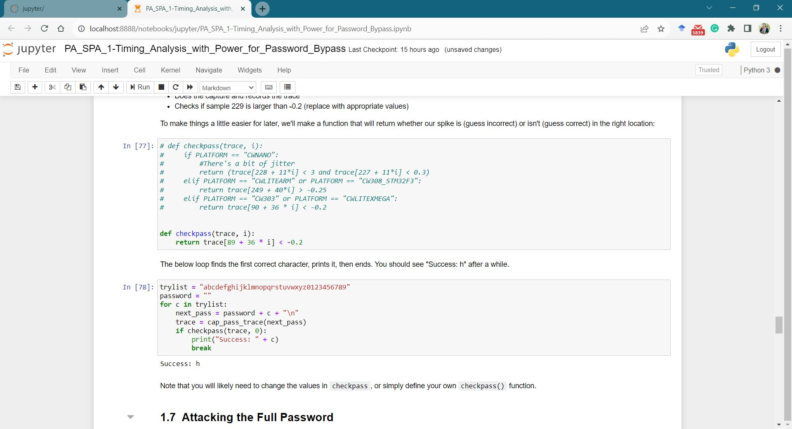

# Task 1

## B. 

The below screenshots show the resulting trace of the instruction I provided. 

This shows 10 x NOP and 10 x MUL output.

Code: 

```c
 /**********************************
     * Start user-specific code here. */
    trigger_high();

    //16 hex bytes held in 'pt' were sent
    //from the computer. Store your response
    //back into 'pt', which will send 16 bytes
    //back to computer. Can ignore of course if
    //not needed

    asm volatile(
        "nop"       "\n\t"
        "nop"       "\n\t"
        "nop"       "\n\t"
        "nop"       "\n\t"
        "nop"       "\n\t"
        "nop"       "\n\t"
        "nop"       "\n\t"
        "nop"       "\n\t"
        "nop"       "\n\t"
        "nop"       "\n\t"
    ::
    );

    asm volatile(
        "mul r0,r1" "\n\t"
        "mul r0,r1" "\n\t"
        "mul r0,r1" "\n\t"
        "mul r0,r1" "\n\t"
        "mul r0,r1" "\n\t"
        "mul r0,r1" "\n\t"
        "mul r0,r1" "\n\t"
        "mul r0,r1" "\n\t"          
        "mul r0,r1" "\n\t"
        "mul r0,r1" "\n\t"
    ::
    );
    
    trigger_low();
    /* End user-specific code here. *
     ********************************/
```

Result: 


This shows 10 x NOP, 10 x MUL, 15 x NOP, 15 x MUL output.

Code:

```c
/**********************************
     * Start user-specific code here. */
    trigger_high();

    //16 hex bytes held in 'pt' were sent
    //from the computer. Store your response
    //back into 'pt', which will send 16 bytes
    //back to computer. Can ignore of course if
    //not needed

    asm volatile(
        "nop"       "\n\t"
        "nop"       "\n\t"
        "nop"       "\n\t"
        "nop"       "\n\t"
        "nop"       "\n\t"
        "nop"       "\n\t"
        "nop"       "\n\t"
        "nop"       "\n\t"
        "nop"       "\n\t"
        "nop"       "\n\t"
    ::
    );

    asm volatile(
        "mul r0,r1" "\n\t"
        "mul r0,r1" "\n\t"
        "mul r0,r1" "\n\t"
        "mul r0,r1" "\n\t"
        "mul r0,r1" "\n\t"
        "mul r0,r1" "\n\t"
        "mul r0,r1" "\n\t"
        "mul r0,r1" "\n\t"          
        "mul r0,r1" "\n\t"
        "mul r0,r1" "\n\t"
    ::
    );
    
    asm volatile(
        "nop"       "\n\t"
        "nop"       "\n\t"
        "nop"       "\n\t"
        "nop"       "\n\t"
        "nop"       "\n\t"
        "nop"       "\n\t"
        "nop"       "\n\t"
        "nop"       "\n\t"
        "nop"       "\n\t"
        "nop"       "\n\t"
        "nop"       "\n\t"
        "nop"       "\n\t"
        "nop"       "\n\t"
        "nop"       "\n\t"
        "nop"       "\n\t"
    ::
    );
    
 asm volatile(
        "mul r0,r1" "\n\t"
        "mul r0,r1" "\n\t"
        "mul r0,r1" "\n\t"
        "mul r0,r1" "\n\t"
        "mul r0,r1" "\n\t"
        "mul r0,r1" "\n\t"
        "mul r0,r1" "\n\t"
        "mul r0,r1" "\n\t"          
        "mul r0,r1" "\n\t"
        "mul r0,r1" "\n\t"
        "mul r0,r1" "\n\t"
        "mul r0,r1" "\n\t"
        "mul r0,r1" "\n\t"          
        "mul r0,r1" "\n\t"
        "mul r0,r1" "\n\t"
    ::
    );


    trigger_low();
    /* End user-specific code here. *
     ********************************/
```

Result: 


## C.

The steps of the attack are as follows:
1. For each key guess, the code computes the correlation between the hypothetical power consumption and the actual power traces.
2. It initializes arrays for the numerator and two denominators.
3. It calculates the hypothetical intermediate values (hyp) based on the key guess.
4. It calculates means for both the hypothetical values and the power traces.
5. It calculates the numerator and denominators for the correlation.
6. Finally, it computes the correlation and the maximum correlation for the current key guess.
7. After processing all key guesses for a subkey, the code selects the key guess with the maximum correlation as the best guess.

The output of the S-Box is used as the sensitive point of the attack. The Hamming Weight of the output data is assumed to be the leaking data of the system by the model. 

The code enters a loop that iterates over each of the 16 subkeys. Within the subkey loop, the code performs an inner loop for each possible key guess. Then as mentioned above, the kguess is considered with the maximum correlation value. The code is as follows. 

```python
for bnum in tqdm(range(0, 16), desc='Attacking subkeys'):
    cpaoutput = [0] * 256
    maxcpa = [0] * 256
    for kguess in range(0, 256):
        sumnum = np.zeros(numpoint)
        sumden1 = np.zeros(numpoint)
        sumden2 = np.zeros(numpoint)

        hyp = np.zeros(numtraces)
        for tnum in range(0, numtraces):
            hyp[tnum] = HW[intermediate(pt[tnum][bnum], kguess)]

        meanh = np.mean(hyp, dtype=np.float64)
        meant = np.mean(trace_array, axis=0, dtype=np.float64)

        for tnum in range(0, numtraces):
            hdiff = (hyp[tnum] - meanh)
            tdiff = trace_array[tnum, :] - meant

            sumnum = sumnum + (hdiff * tdiff)
            sumden1 = sumden1 + hdiff * hdiff
            sumden2 = sumden2 + tdiff * tdiff

        cpaoutput[kguess] = sumnum / np.sqrt(sumden1 * sumden2)
        maxcpa[kguess] = max(abs(cpaoutput[kguess]))
```
The best key guess is achieved by the command `maxcpa[kguess] = max(abs(cpaoutput[kguess]`. 

Below are screenshots of successfully finding out the encryption key. 


If the key is not generated in particular cases, the accuracy can be improved by increasing the number of traces, mistakes in the algorithm, etc. The noise, impact of environmental conditions, electromagnetic interferences, complex S-Box operations are some of the other reasons that the result is being wrong. 

# Task 2

## A.

When the first letter is wrong the power traces start to change at the 3rd wave of the signal. The wavelength is around 36 in time scale and therefore separate letter is considered in each 36 samples. I tried with the major peak values to get an output and the correct output was delivered when the peak is at 89 whilst there are no output to other 2 peak values; 72 and 81. The peak exceeds -0.2 and therefore the value is chosen. 
I could successfully obtain the first letter of the password.



The edited script is as follows.

```python
def checkpass(trace, i):
    return trace[89 + 36 * i] < -0.2
```

The successful attack:


## B.


# Task 3

## A.

The correct parameters can be found by changing the parameters step by step. 

 ```python
 offset_range = Range(-30, 30, 1)
 width_range = Range(-30, 30, 1)
 ```

The screenshots of the attack glitch1():


As in the plot, the graph of success data points are available from width_range -30 to 30. If I consider the good range as ` offset_range = Range(-10, 15, 1)` and `width_range = Range(-10, 15, 1)`, the `glitch3()` output appears as shown below.

Added code snippet:
```python
width_range = Range(-10, 15, 1)
if PLATFORM == "CW303" or PLATFORM == "CWLITEXMEGA":
    offset_range = Range(-10, 15, 1)
    scope.glitch.repeat = 105
```

I tried to run the code on my PC and I got the below error after running the code for 15-20 minutes. 


The code was executed successfully for the members of my group. 
Results:


## B. 

The successful glitching attack is as shown below.


Before: `bootloader.c`: 

```c
int i;
			for(i = 0; i < ascii_idx; i++)
			{
				putch(ascii_buffer[i]);
			}
```

Before: `bootloader-CW303.lss`: 

```as
int i;
			for(i = 0; i < ascii_idx; i++)
 594:	80 e2       	ldi	r24, 0x20	; 32
 596:	c4 38       	cpi	r28, 0x84	; 132
 598:	d8 07       	cpc	r29, r24
 59a:	21 f0       	breq	.+8      	; 0x5a4 <main+0xaa>
			{
				putch(ascii_buffer[i]);
 59c:	89 91       	ld	r24, Y+
 59e:	0e 94 c1 01 	call	0x382	; 0x382 <output_ch_0>
 5a2:	f8 cf       	rjmp	.-16     	; 0x594 <main+0x9a>
			}
```

After: `bootloader.c`: 

```c
volatile int i;
			for(i = 0; i < ascii_idx; i++)
			{
				putch(ascii_buffer[i]);
			}
```

After: `bootloader-CW303.lss`:

```as
volatile int i;
			for(i = 0; i < ascii_idx; i++)
 5bc:	89 81       	ldd	r24, Y+1	; 0x01
 5be:	9a 81       	ldd	r25, Y+2	; 0x02
 5c0:	01 96       	adiw	r24, 0x01	; 1
 5c2:	89 83       	std	Y+1, r24	; 0x01
 5c4:	9a 83       	std	Y+2, r25	; 0x02
 5c6:	ef cf       	rjmp	.-34     	; 0x5a6 <main+0xac>
			{
				putch(ascii_buffer[i]);
			}
```

I couldn't find the `brne` instruction available in my assembly code. Below is my group member's output. 

Before: 
```as
000008ce <.LVL27>:
			
			int i;
			for(i = 0; i < ascii_idx; i++)
 8ce:	ce ee       	ldi	r28, 0xEE	; 238
 8d0:	d0 e2       	ldi	r29, 0x20	; 32

000008d2 <.L9>:
			{
				putch(ascii_buffer[i]);
 8d2:	89 91       	ld	r24, Y+

000008d4 <.LVL29>:
 8d4:	0e 94 77 03 	call	0x6ee	; 0x6ee <output_ch_0>

000008d8 <.LVL30>:
			for(i = 0; i < ascii_idx; i++)
 8d8:	ec 16       	cp	r14, r28
 8da:	fd 06       	cpc	r15, r29
 8dc:	d1 f7       	brne	.-12     	; 0x8d2 <.L9>

``````as
000008ce <.LVL27>:
			
			int i;
			for(i = 0; i < ascii_idx; i++)
 8ce:	ce ee       	ldi	r28, 0xEE	; 238
 8d0:	d0 e2       	ldi	r29, 0x20	; 32

000008d2 <.L9>:
			{
				putch(ascii_buffer[i]);
 8d2:	89 91       	ld	r24, Y+

000008d4 <.LVL29>:
 8d4:	0e 94 77 03 	call	0x6ee	; 0x6ee <output_ch_0>

000008d8 <.LVL30>:
			for(i = 0; i < ascii_idx; i++)
 8d8:	ec 16       	cp	r14, r28
 8da:	fd 06       	cpc	r15, r29
 8dc:	d1 f7       	brne	.-12     	; 0x8d2 <.L9>

```

After:

```as
000008d2 <.Loc.78>:
			
			volatile int i;
			for(i = 0; i < ascii_idx; i++)
 8d2:	19 82       	std	Y+1, r1	; 0x01
 8d4:	1a 82       	std	Y+2, r1	; 0x02

000008d6 <.L9>:
 8d6:	89 81       	ldd	r24, Y+1	; 0x01
 8d8:	9a 81       	ldd	r25, Y+2	; 0x02

000008da <.Loc.83>:
 8da:	08 97       	sbiw	r24, 0x08	; 8
 8dc:	9c f0       	brlt	.+38     	; 0x904 <.L10>

000008de <.Loc.84>:
			{
				putch(ascii_buffer[i]);
			}
```

The compiler makes a few assumptions before modifying the variable **i**. The loop comparison is based on equality and uses the cp and cpc instructions to determine whether the variable **i** (ascii_idx) has reached the predefined value. The variable **i** is directly loaded into a register (r24). Depending on the outcome of the comparison, it raises flags in the status register. The Z (zero) flag in the Status Register is then checked by the **brne** instruction. The branch is taken and the loop is continued if the Z flag is not set, meaning that the two values being compared are not equal. Through the use of the z flag, the loop is operating longer than it was designed to.
Following the code modification, the compiler handles `i` in a different way. Since the variable `i` is now regarded as volatile, std and ldd instructions are used to load and store its value in and out of memory. Instead of directly comparing with the predefined number, the loop comparison is predicated on whether `i`, the loop counter, has hit zero. The **brlt** instruction determines when the loop ends by checking to see if `i` has gone negative, and the **sbiw** instruction decreases `i` by 8 for each iteration. Accessing memory locations beyond the intended value is generally less likely to occur when the **brlt** instruction is glitched. It might not provide the expected results of memory location beyond `ascii_idx`, even though it can still break the loop. 
However, I would still argue that it is possible to attack and alter the program's behavior by glitching the sign bit (S flag) in the Status Register. To do this, however, one would need to have a deep understanding of the particular hardware architecture as well as the compiler's optimizations. However, I would still argue that it is possible to attack and alter the program's behavior by glitching the sign bit (S flag) in the Status Register. To do this, however, one would need to have a deep understanding of the particular hardware architecture as well as the compiler's optimizations. 
