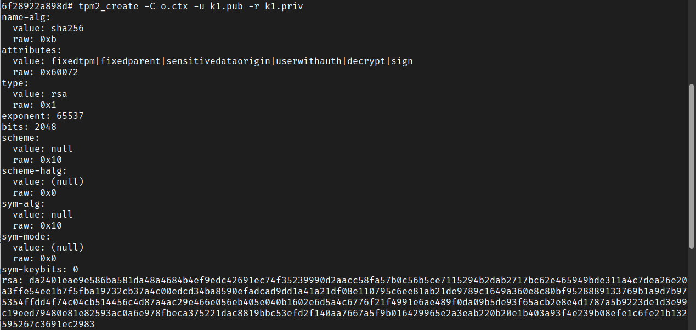
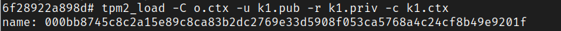
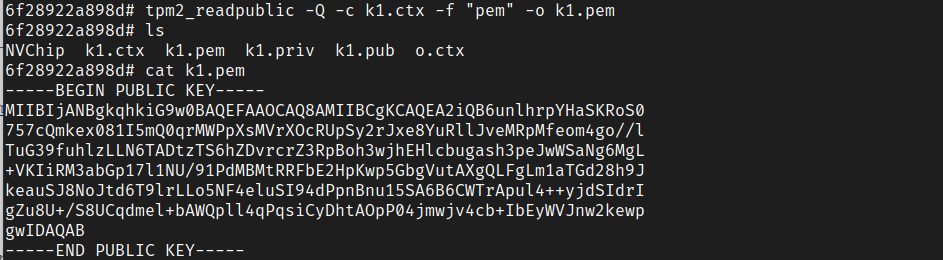
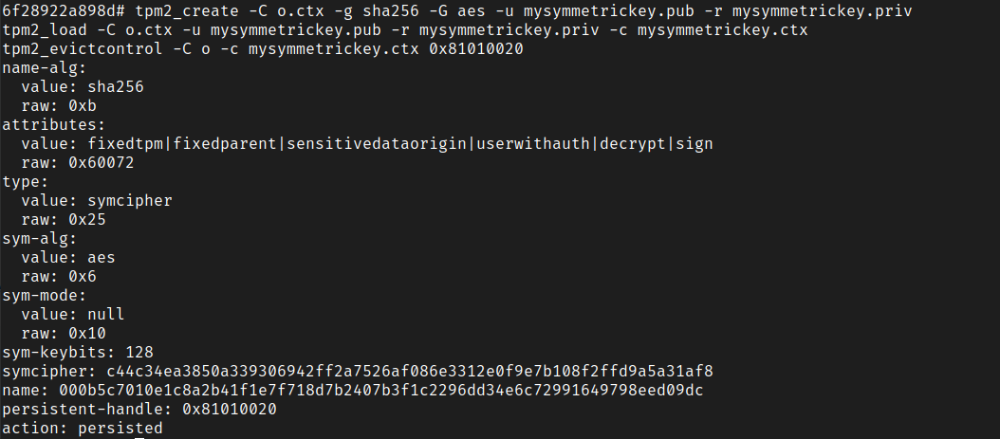
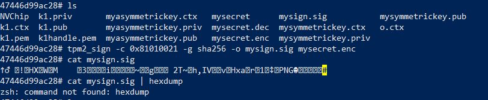
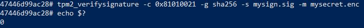
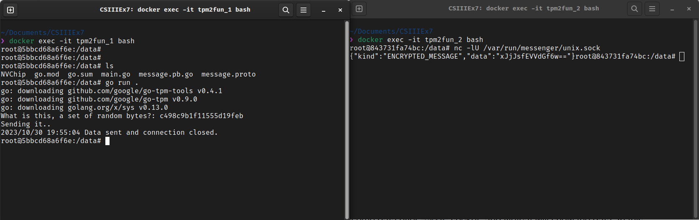

# Task 1

### 1. 
The command: `tpm2_getrandom 30`

The output:

```terminal
0b1e876a5d65# tpm2_getrandom 30        
b�`���e��'�J���f-�;4AN��WV
```

The entropy can be increased by giving below commands.
```terminal
echo -n "myrandomdata" | tpm2_stirrandom
dd if=/dev/urandom bs=1 count=64 > myrandom.bin
tpm2_stirrandom < ./myrandom.bin
```

### 2. 
The command gave the below key.

```terminal
6f28922a898d# tpm2_createprimary -C o -g sha256 -G ecc -c o.ctx      
name-alg:
  value: sha256
  raw: 0xb
attributes:
  value: fixedtpm|fixedparent|sensitivedataorigin|userwithauth|restricted|decrypt
  raw: 0x30072
type:
  value: ecc
  raw: 0x23
curve-id:
  value: NIST p256
  raw: 0x3
kdfa-alg:
  value: null
  raw: 0x10
kdfa-halg:
  value: (null)
  raw: 0x0
scheme:
  value: null
  raw: 0x10
scheme-halg:
  value: (null)
  raw: 0x0
sym-alg:
  value: aes
  raw: 0x6
sym-mode:
  value: cfb
  raw: 0x43
sym-keybits: 128
x: 4a6c2fef684bbd3e6ae019c4dd7a827db2d2fef2f88e30dd831f1c8a7f986909
y: 7b4d6e306d7567f0fdfd86658bb0ffbc7364d5e8ad321b28927c0ec724ae98f9
```

In cryptographic key generation, the seed is a critical initial value used to derive cryptographic keys. It provides entropy, ensuring key unpredictability and security. Each unique seed generates a primary key, serving as the root for all derived keys in a hierarchy. If the seed is changed, the entire hierarchy becomes useless. For instance, in TPM (Trusted Platform Module) chips, a unique seed is burned in during manufacturing, creating two key pairs: an Endorsement Key (EK) and an Attestation Key (AK). These keys are generated from the unique seed, serving specific purposes within the TPM. The seed's security and confidentiality are paramount to the overall integrity of the cryptographic system.

As per the description given in the [Nokia's TPM course](https://github.com/nokia/TPMCourse/blob/master/docs/STARTHERE.md) the Owner hierarchy is typically accessible for use by applications. The keys and operations within the Owner hierarchy are available for use by authorized applications or services. Applications can utilize these keys to perform various cryptographic functions, such as encryption, decryption, authentication, and digital signing.

### 3. 
The usable key generation:

```terminal
tpm2_create -C o.ctx -u k1.pub -r k1.priv
```


The RSA key:
```terminal
rsa: da2401eae9e586ba581da48a4684b4ef9edc42691ec74f35239990d2aacc58fa57b0c56b5ce7115294b2dab2717bc62e465949bde311a4c7dea26e20a3ffe54ee1b7f5fba19732cb37a4c00edcd34ba8590efadcad9dd1a41a21df08e110795c6ee81ab21de9789c1649a360e8c80bf9528889133769b1a9d7b975354ffdd4f74c04cb514456c4d87a4ac29e466e056eb405e040b1602e6d5a4c6776f21f4991e6ae489f0da09b5de93f65acb2e8e4d1787a5b9223de1d3e99c19eed79480e81e82593ac0a6e978fbeca375221dac8819bbc53efd2f140aa7667a5f9b016429965e2a3eab220b20e1b403a93f4e239b08efe1c6fe21b132595267c3691ec2983
```

Loading the key to TPM:

```terminal
tpm2_load -C o.ctx -u k1.pub -r k1.priv -c k1.ctx
```


Printing the public key in `PEM` format:

```terminal
6f28922a898d# tpm2_readpublic -Q -c k1.ctx -f "pem" -o k1.pem
```



```$
6f28922a898d# cat k1.pem
-----BEGIN PUBLIC KEY-----
MIIBIjANBgkqhkiG9w0BAQEFAAOCAQ8AMIIBCgKCAQEA2iQB6unlhrpYHaSKRoS0
757cQmkex081I5mQ0qrMWPpXsMVrXOcRUpSy2rJxe8YuRllJveMRpMfeom4go//l
TuG39fuhlzLLN6TADtzTS6hZDvrcrZ3RpBoh3wjhEHlcbugash3peJwWSaNg6MgL
+VKIiRM3abGp17l1NU/91PdMBMtRRFbE2HpKwp5GbgVutAXgQLFgLm1aTGd28h9J
keauSJ8NoJtd6T9lrLLo5NF4eluSI94dPpnBnu15SA6B6CWTrApul4++yjdSIdrI
gZu8U+/S8UCqdmel+bAWQpll4qPqsiCyDhtAOpP04jmwjv4cb+IbEyWVJnw2kewp
gwIDAQAB
-----END PUBLIC KEY-----
```

### 4.
A symmetric key is generated. 



```terminal
symcipher: c44c34ea3850a339306942ff2a7526af086e3312e0f9e7b108f2ffd9a5a31af8
name: 000b5c7010e1c8a2b41f1e7f718d7b2407b3f1c2296dd34e6c72991649798eed09dc
```

The file has encrypted and decrypted successfully. 

```terminal
f28922a898d# tpm2_encryptdecrypt -d -c 0x81010020 -o mysecret.dec mysecret.enc
WARN: Using a weak IV, try specifying an IV
6f28922a898d# diff mysecret mysecret.dec 
cmp mysecret mysecret.dec  
cat mysecret 
Cyber Security III Piyumi
6f28922a898d# cat mysecret.dec
Cyber Security III Piyumi
```

The ciphertext is signed with the ECC keys. I changed the 

```terminal
tpm2_create -C o.ctx -g sha256 -G ecc -u myasymmetrickey.pub -r myasymmetrickey.priv
tpm2_load -C o.ctx -u myasymmetrickey.pub -r myasymmetrickey.priv -c myasymmetrickey.ctx
tpm2_evictcontrol -C o -c myasymmetrickey.ctx 0x81010021
tpm2_sign -c 0x81010021 -g sha256 -o mysign.sig mysecret.enc
```

I had to change from VM to docker desktop. That's why the change in the appearance of the terminal. 



The `echo` output as `0` verifies the signature. 



# Task 2

The message is successfully sent to the Netcat window.




# Task 3

The essay is attached [here.](Task_3_Essay.pdf)
